# Case and Cover for Silakka54 "AliExpress v1.3 Edition"
Table of Content: [About](#about) |[Files](#files) | [Printing](#printing) | [Support Version](#supported-version)

> Bonus content: [Case for v1.2](#bonus-content-case-for-v12)

## About
>  A one-piece case and a controller cover for the [Silakka54](https://github.com/Squalius-cephalus/silakka54/) in its unofficial [AliExpress v1.3 edition](#supported-version).
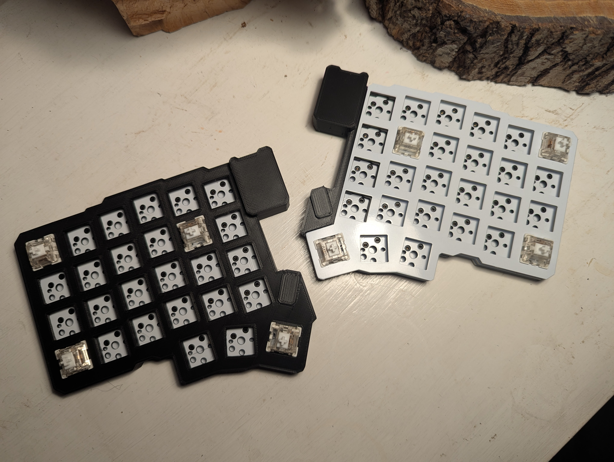

*Case*  
- A top-mounted case with plate.
- Held in place by switches and a ledge near the controller.
- Used with bottom from the standard sandwich case.

*Cover*
- A minimal cover that just covers the controller and TRRS, and the non-plate-covered part of the PCB. 
- Held in place by switches and a ledge near the controller. 
- Used with both plate and bottom from the standard sandwich case.

> Trim the top off the inner column of header pins for the cover to slide over controller.
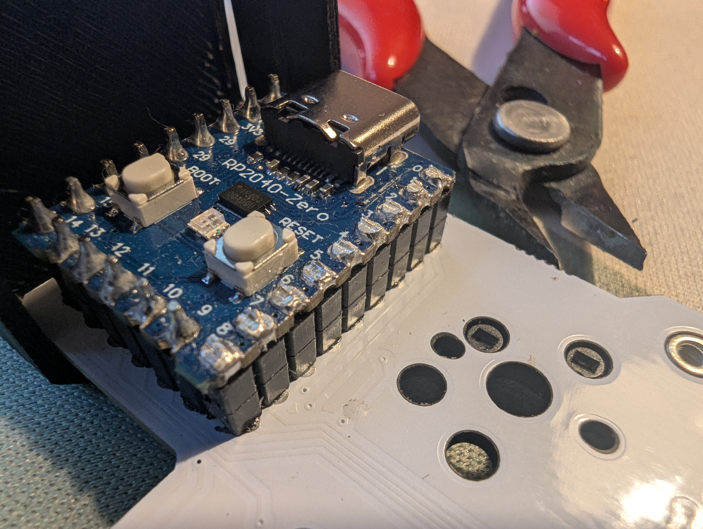

> The case reuses the bottom plate from the Silakka54 sandwich case. The cover reuses both switch plate and bottom plate.
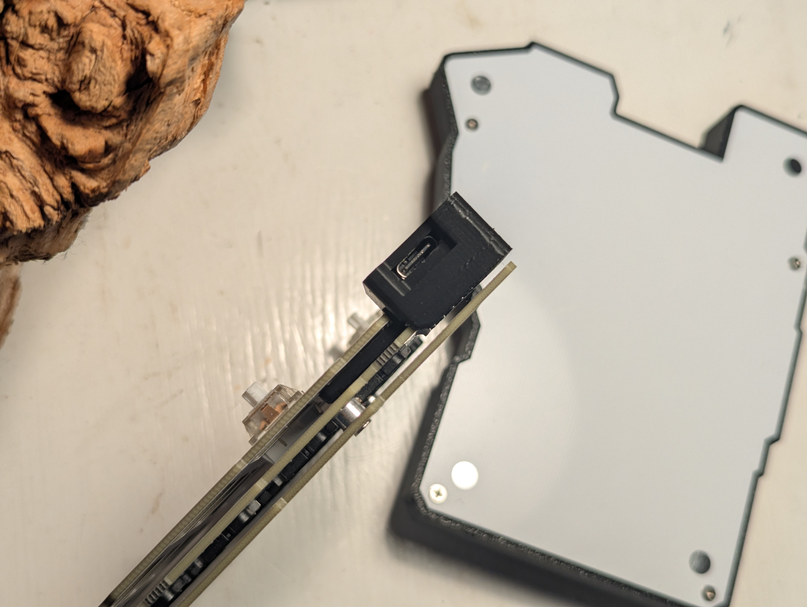

The [Silakka54](https://squalius-cephalus.github.io/silakka54/) by [Squalius-cephalus](https://github.com/Squalius-cephalus) is a sane defaults, no-frills beginner-friendly split keyboard. With its budget-friendlyness, generous number of keys, top-notch firmware by and QMK and Vial support, it gets well-deserved attention. I bought some from AliExpress to try out, and am happy to recommend it to people new to more ergo-boards.

> Does it support keycaps? Yes!
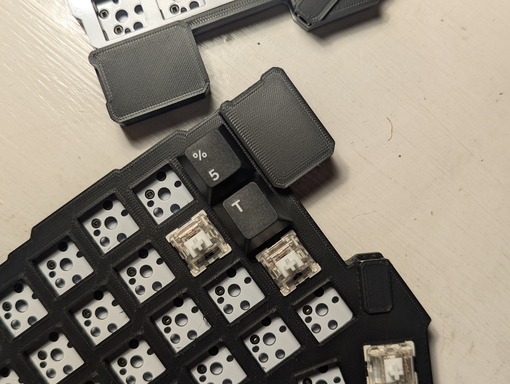

In the FR4 sandwich-case design, the RP2040 Zero MCU and TRRS connector are both bared. I think they deserve a bit of cover. Cases exist [1](https://www.printables.com/model/1248872-slim-silakka54-screwless-case), [2](https://www.printables.com/model/1167880-silakka54-case), but I wanted something slimmer. After some revisions, I got the idea to reuse the bottom plate in a top-mount case. The minimal cover soon followed. 

> Does it support USB and TRRS? Yes!
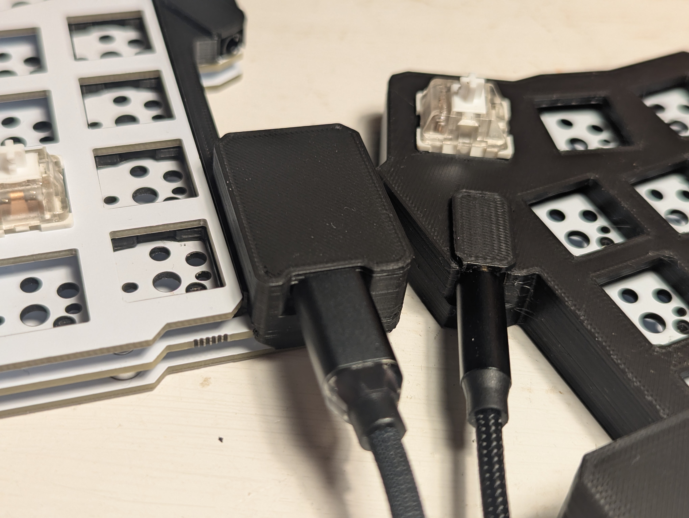

The cases are done almost from scratch in Onshape, in [public workspaces](#files). For outline and switch hole placement, I used the official [Silakka54 top plate STL](https://github.com/Squalius-cephalus/silakka54/tree/main/stl) (imported to TinkerCAD and exported as SVG, opened in Inkscape and exported as DXF R12, imported in Onshape, inserted in sketch).

> Does it have supertight margins for USB and TRRS so it can fit versions with very small handles? No :)
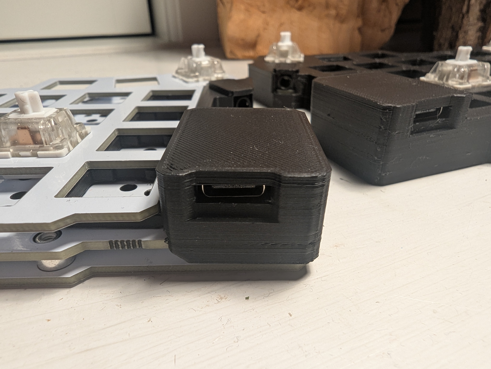

## Files
3D view on [Printables](https://www.printables.com/model/1458709-silakka54-case-and-controller-cover).

This directory holds STL files for case and cover. I've drawn them in Onshape, from where you can export more formats. The workspaces are public:
- [Case](https://cad.onshape.com/documents/ac2b1008b1e54d39eee7ffea/w/31bafba10fbd2278af9c4c7d/e/d5d6406748a2ba0de6605a23)
- [Cover](https://cad.onshape.com/documents/e2461bf9dbd48bab8d95e3e2/w/3499d5dbfcf3e4be87407c19/e/ac8083f188c7b61fd47aa49c)

## Printing
Printed on an Ender-3 S1 Plus w. 0.4mm nozzle. This dir has the used Cura profile*, which amounts to:
- Bottom Surface Skin Layers: 1
- Top Surface Skin Layers: 2
- Top Surface Skin Line Width: 3
- Top Surface Skin Flow: 95
- Top Surface Skin Speed: 30
- Top/Bottom Flow: 80
- Monotonic Top/Bottom Order: True
- Supports: Normal. Density: 15
- Z Hop When Retracted, Only Over Printed Parts, Height 0.4
- Retract at Layer Change: False
- Z Seam manually positioned on the chamfer-side of the case corner by the usb.

> * Slicer settings may have developed over a perhaps somewhat chaotic trial and error process.

## Supported Version

The AliExpress versions I have seen have both controllers facing up. 

The version number is printed on the PCB under the controller. Between v1.2 and v1.3, the PCB outline differs. V1.2 has removable spacers between PCB and bottom, while v1.3 soldered spacers.

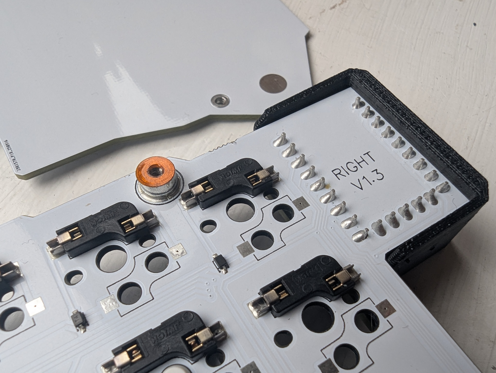

# Bonus Content: Case for v1.2

> [!NOTE]
> Please read the text before you download the case, pay someone to print it, and get disappointed.

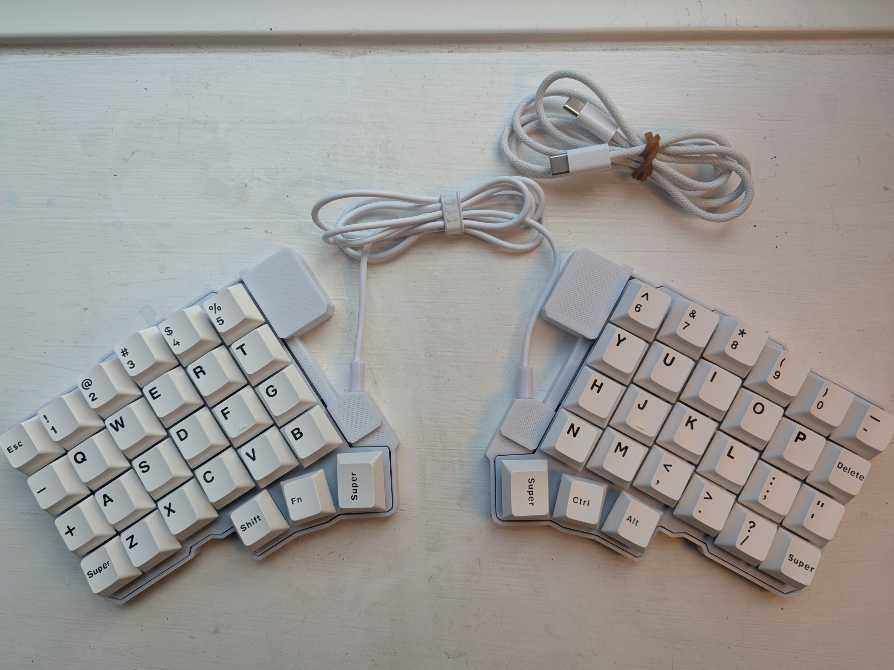 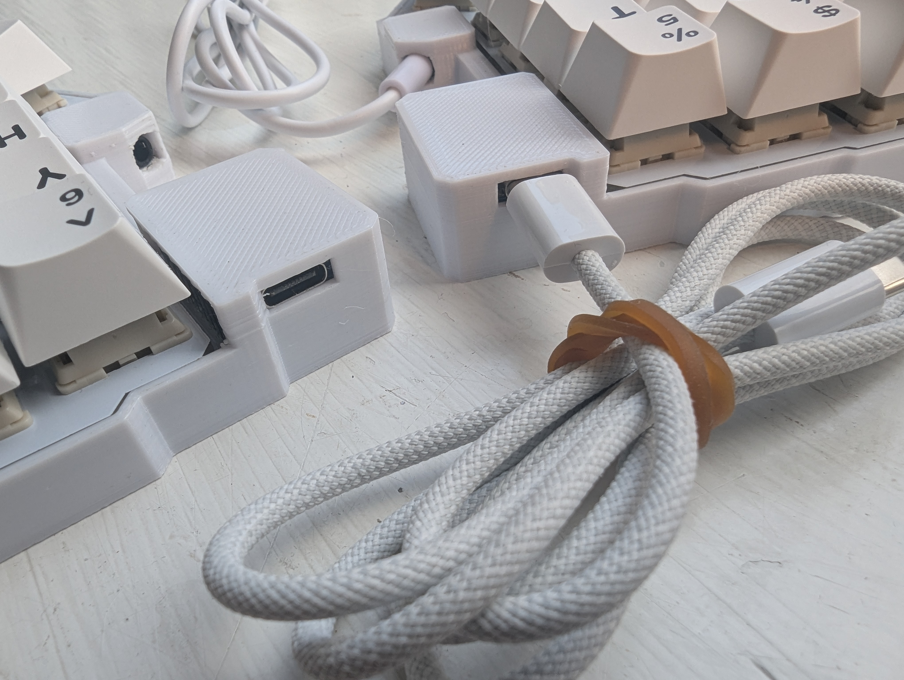 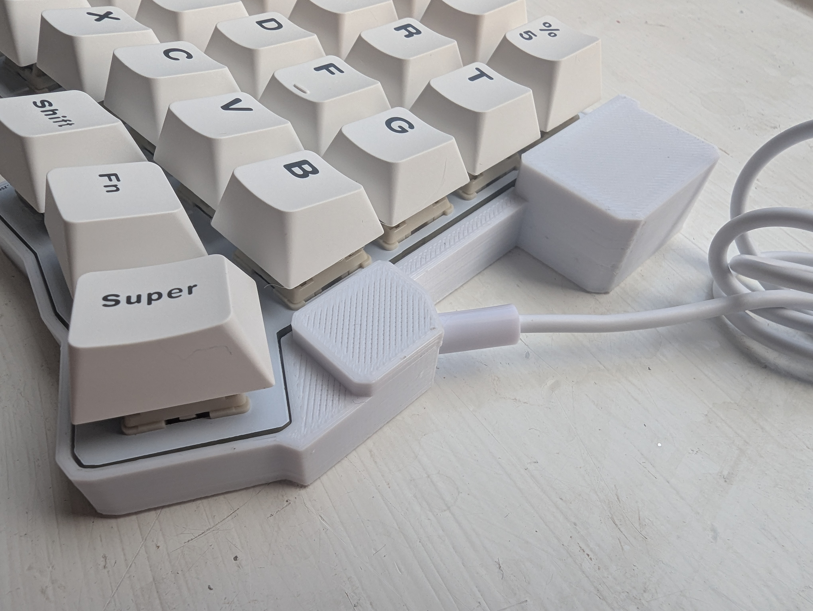  

I've had a v1.2 too, which I also did a case for. I initiated the design wanting it screwless, held in place by friction.
 I'm not good enough with my printer to make that work, I learned :D

So I did a version where the screw-on spacers pushed into the bottom, no screws. It worked fine, but I think maybe the spacers had to be just the right amount of loose on the PCB because the spacer holes were not 100% correctly positioned, so full tightness resulted in the PCB pulling the case making the bottom arch slightly. Not something that I'd notice on a deskmat, but on a hard surface, yes.

Did I places some small o-rings between spacer screws and PCB for some slack? I think so.

Anyways, here it is, sorry for the messy workspace:
- [Case for v1.2](https://cad.onshape.com/documents/518b03e72a2b4cf4840c6618/w/309783c02a42935e761f2106/e/88c88d6adf255d44b8f63fc2?renderMode=0&uiState=6916417c2c7f2e083b970483)

### Assembly

You need the spacers that came with the v1.2 case, and half the screws --- that's 4 of each :)  
 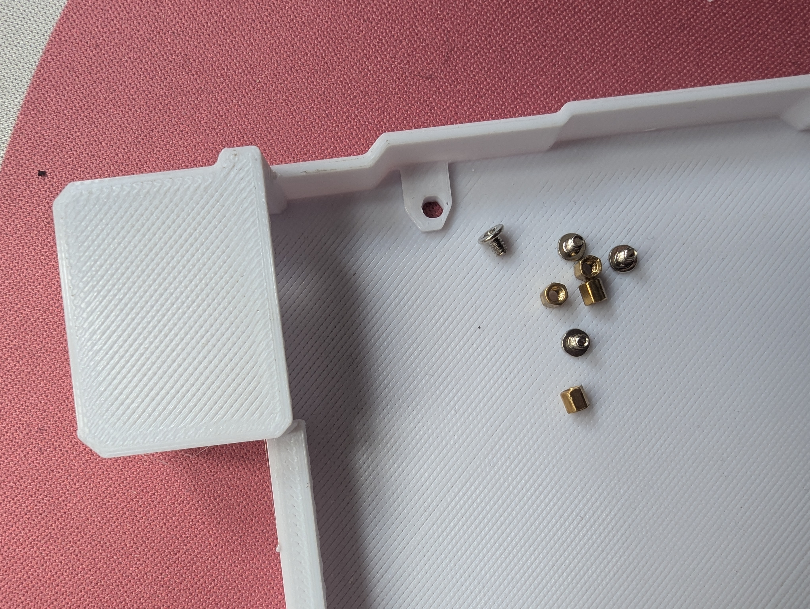 
 
I placed the spacers in the case from the bottom:  
 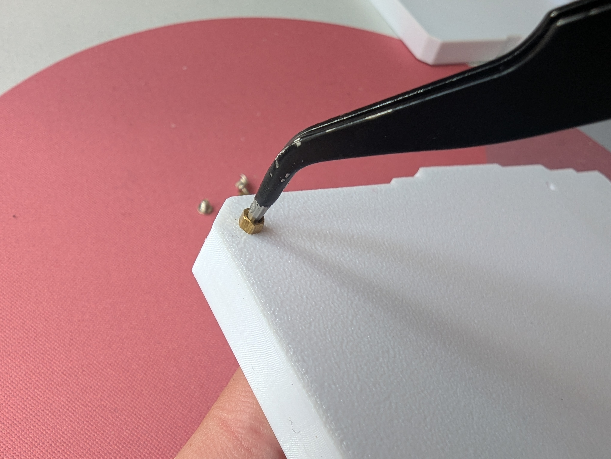

Pushed them in untill flush:  
   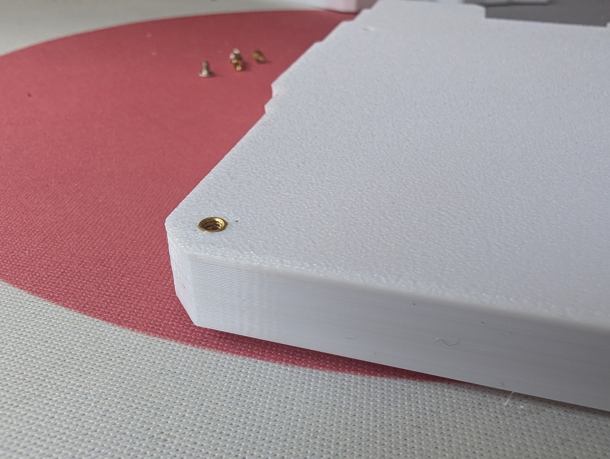

Then quite carefully *slid* in the PCB into the housings. Finally, screws from PCB to spacers.

> [!CAUTION]
> It's a tight fit, getting the PCB in. But it fits. Be careful to not force up either mcu nor trrs roof much, as you may break a bit of their supporting pillars (supergluable, though).

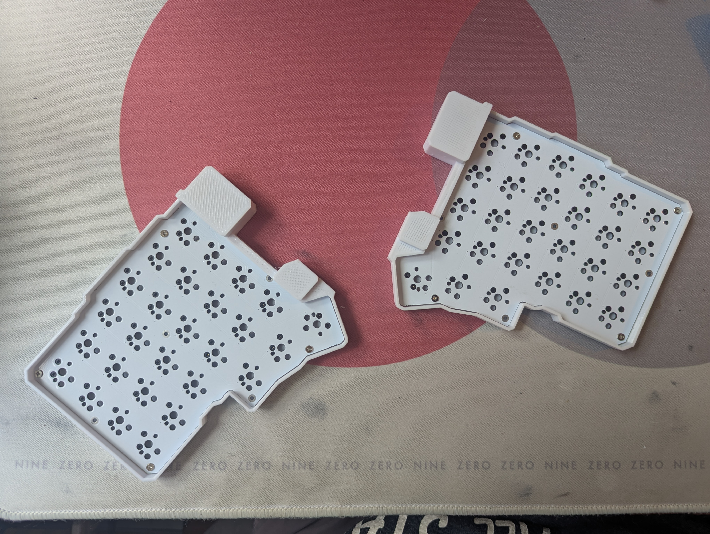  