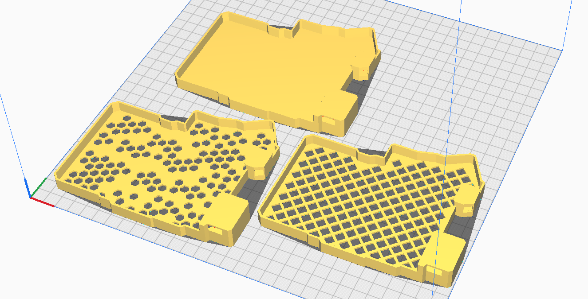

# Silakka54 One-Piece Case
For AliExpress Silakka54, i.e., where both MCU face up.

## TL;DR
- Requires only the insets and screws used in the Silakka54 sandwich case (4 Ø3 mm ... and 4 X mm M2 screws).
- STL and Cura profile files (for Ender S1 Plus) for the right side is included.
    - For the left side, mirror the right part in Cura, and adjust `Z seam X` from `0.0` to `300`.

## Intro
    
The [Silakka54](https://squalius-cephalus.github.io/silakka54/) by [Squalius-cephalus](https://github.com/Squalius-cephalus)
is a sane defaults beginner-friendly split keyboard.
With its budget-friendlyness, generous number of keys and QMK and Vial support, its gotten well-deserved attention.
I bought one to try it out, and am happy to recommend it to people new to more ergo-boards.
Once I'm done with this case, I'll lend it to a programmer colleague who wants to try a split.

In the FR4 sandwich-case design, the RP2040 Zero MCU and TRRS connector are both bared. I think they deserve a bit of cover. 
As I recently acquired a used Ender 3 S1 Plus for 800 DKK, I printed the 
[Slim Silakka54 screwless case](https://www.printables.com/model/1248872-slim-silakka54-screwless-case) by Johnny5iv, 
a remix of the [the original](https://www.printables.com/model/1167880-silakka54-case) by Squalius.
I'm not really good at printing getting the bottom nice, with angles of the cover, and the cover taps breaking off. 
Aesthetically, I find the walls a bit thick.

So, I've tried my hand at 3d modeling a remix. It's one piece, the cover is less and with flat tops, and the walls are thinner. 
It's almost from scratch, but for the PCB outline, that I coplied copied from the original `base.step`.

## Design Files on Onshape
I'm on Linux with zero CAD experience.
I had issues getting [Autodesk-Fusion-360-for-Linux](https://github.com/cryinkfly/Autodesk-Fusion-360-for-Linux) running
and was then too impatient to learn FreeCAD, so I jumped on Onshape. I hope the workspace makes sense to navigate. The edit history may be... somewhat chaotic.

- [Public Onshape Document](https://cad.onshape.com/documents/518b03e72a2b4cf4840c6618/w/309783c02a42935e761f2106/e/88c88d6adf255d44b8f63fc2?renderMode=0&uiState=686eb00237959c2f0f319326)

## STL Files

I've added STL files for three version of the bottom (right only, for left mirror in slicer):
- Solid
- Chaotic honeycomb
- Net

I made the non-solid ones as my prints of the solid bottom kept turning unadhesing or wavy.
I haven't been crazy with the sound of some of the printed Corne cases I've dealt with,
so I also aimed for a bottom pattern that would have less of that plastic enclosedness.

See and rotate them on [Printables]().

## Slicing and Printing
On my Ender 3 S1 Plus with silicone spacers, xxx plate and 0.4 mm nozzle, I use the `right_ender3s1plus.curaprofile` Cura profile to slice, then print from an SD card using PLA.

The Z seam is set to avoid the fragiler beams of the MCU and TRRS covers by being mainly on the lower, outer corner of the MCU cover and on the outside of the TRRS cover.

With this profile and careful (noob) levelling, I've finally managed to print the solid bottomed cases properly.
