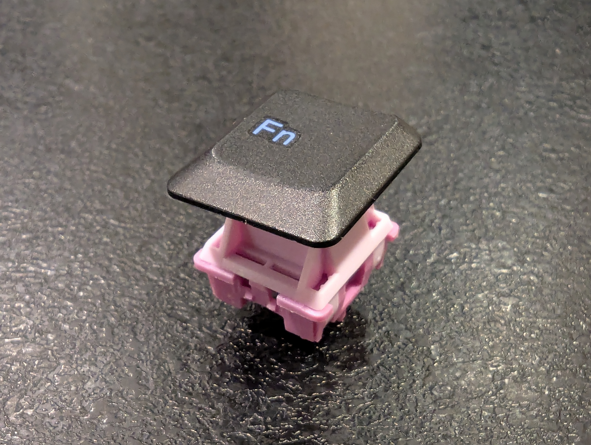
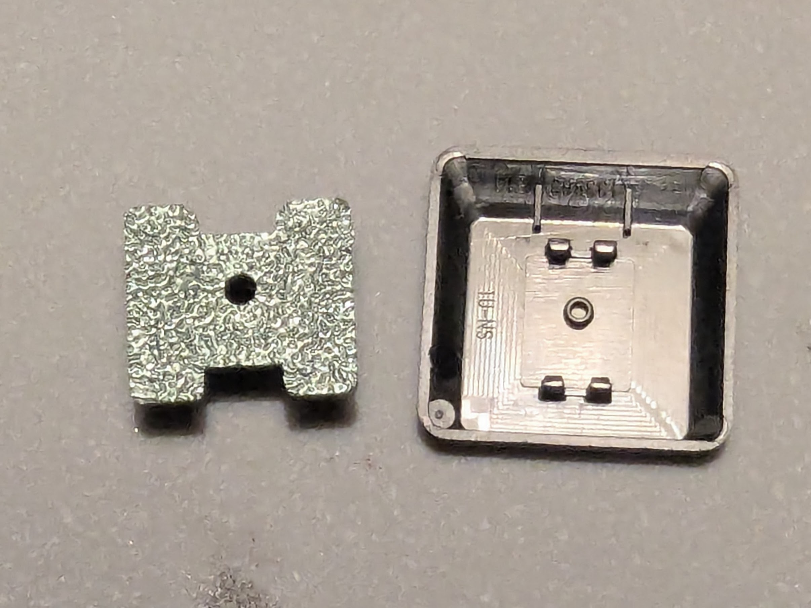
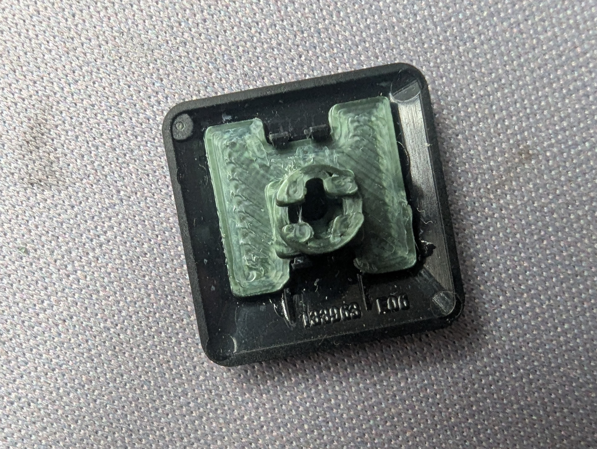
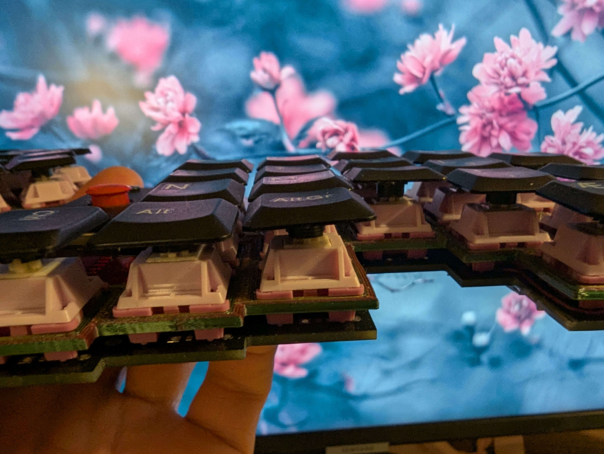
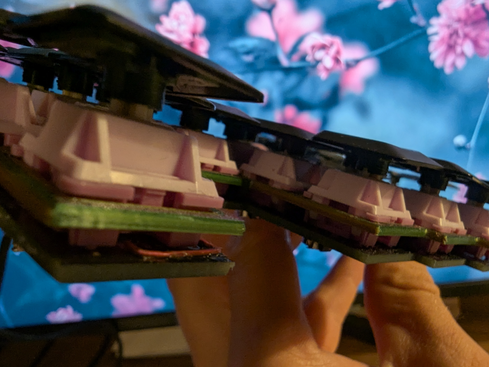
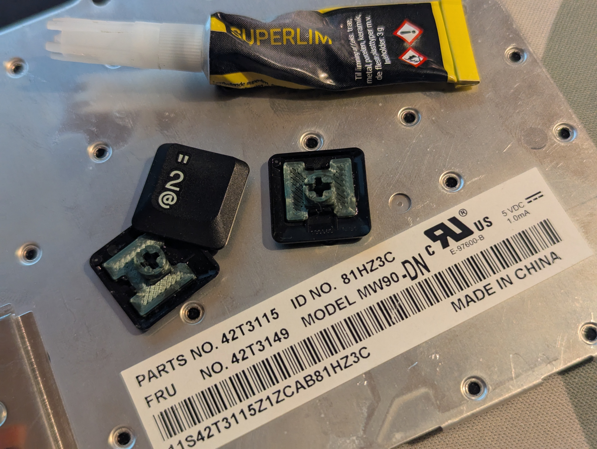
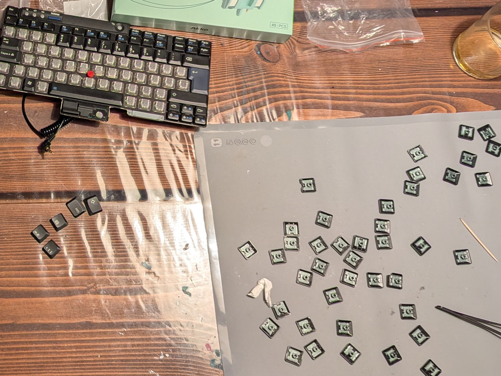

# ThinkPad MX Stems

> MX converters for (one type of) classic ThinkPad keycaps

    

After moving my painstakingly home-printed CLP keycaps to my new main board to be kept at work, 
I wanted something else than Cherry profile for my home board.

Due to enthusiasm for classic ThinkPads and TrackPoints on keyboards, I had a classic ThinkPad keyboard to spare.

So I popped off a keycap to see if it'd make any sense to attempt to print an MX stem for it. It turned out to be pretty nicely fittable. So it sat down in Onshape and did small click-and-glue-on MX stem thingy. Then superglued them on.

## Outcome
- Are the keycaps perfect? No. 
- Are they all super straight and totally without wobble? No.
- Do they thock? No.
- Can I embrace their jankyness and love them for a while? Yes.

   

## Process
- Could I have taken more care applying the superglue? Yes.
- Should I some times have applied slightly less superglue? Yes.
- Was it painstackingly slow? No.
- Did some stems break because I forced them on the switches? Yes.
- Did I pay attention to whether some keys had their underside design flipped upside-down? No.

 

> Future
- Have I considered adding an angled variant, but strugled with how to keep printing super easy? Yes.
- Would I do it again for ThinkPad keycaps with another underside design? Probably.
- Do I think you could convert a full set to use on e.g. a TEX Shinobi or Shura? I haven't checked, but I'm not dismissive.
- If I was still using my TEX boards, would I prefer to undergo conversion for the remaining keys over cutting Cherry keys to fit? Yes.

## Printing
Printed with a 0.4mm nozzle on an Ender 3 S1 Plus, flat, standard quality Cura profile, but layer height 0.16mm. I printed some tests, then 40 in one go over night.

This directory hold the STL file that I've printed from, and a STEP file I also exported from Onshape (though I've never opened one, as I haven't gotten further than using Onshape).
