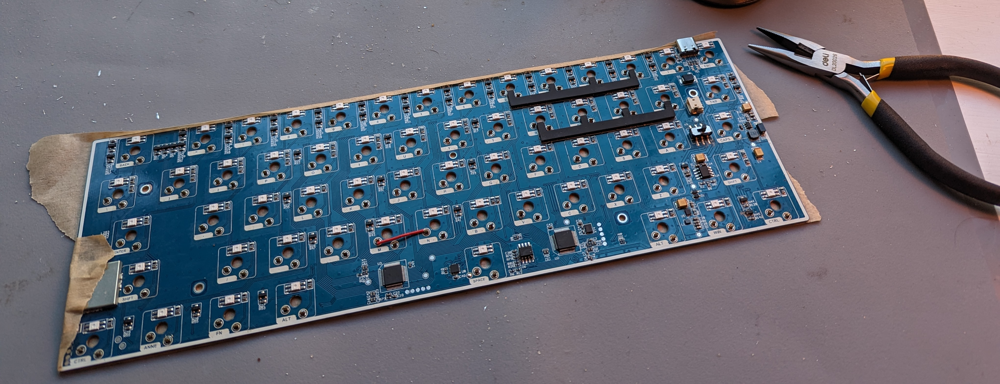
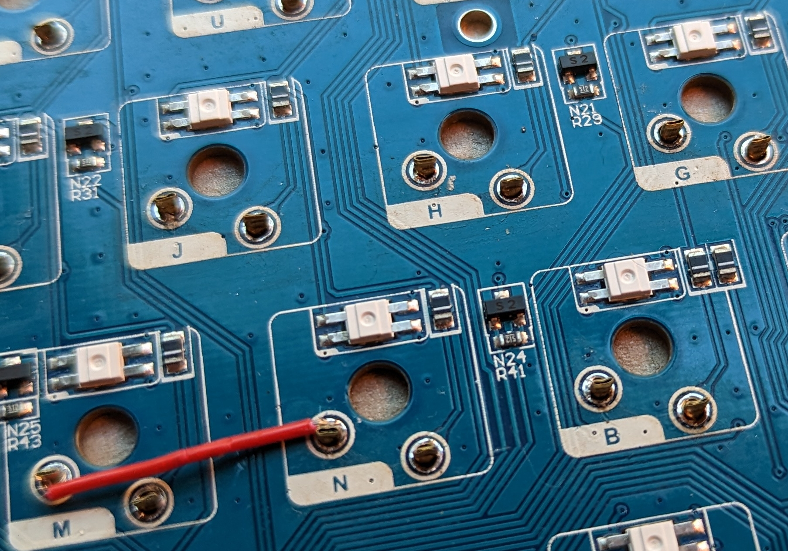
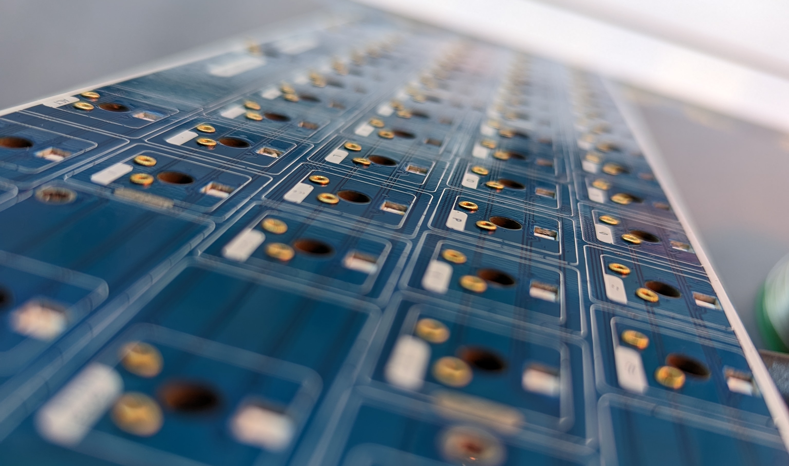
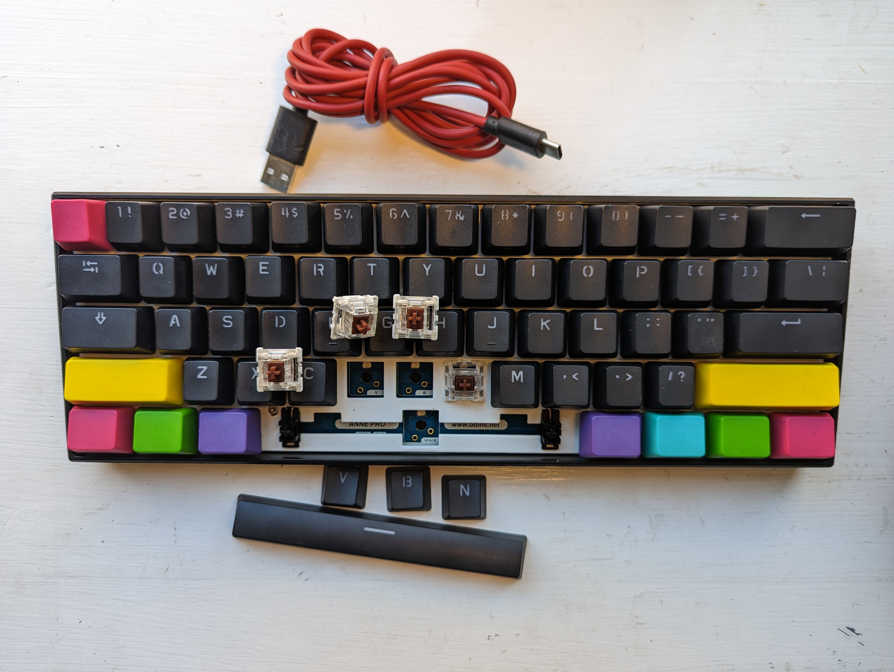

# Anne Pro 2: Hotswap modded using rivets

I hotswap modded an Anne Pro 2 using _rivets_, a very budget-friendly alternative to Mill Max sockets. I used _M1.3*3.5 mm_ copper hollow rivets (the numbers are diameter and length). I got 1000 pcs for ~4 USD from [Zhongfa Precision Hardware Co. on AliExpress](https://a.aliexpress.com/_msDm7v6). You need two per switch.

The procedure was as follows:
1. Disassemble keyboard and unsodler switches.
2. Place and squeeze rivets, on key at the time:
  a. Place rivets in two switch pin holes.
  b. Insert the switch.
  c. Hold it in place and flip over the PCB.
  d. Squeeze each rivet around its switch pin with a pair of thongs.
    - This is to ensure contact, so don't under-squeeze.
    - Don't over-squeeze either: you need to be able to remove the switch.
    - The pins are flat: squeeze on their long sides.
  e. Once both rivets are squeezed, you can remove the switch: the rivets can rotate, but not fall out.
3. Fix the rivets flush to the PCB top using tape.
  - You don't want them hovering over the pcb after soldering: then the switches will be crooked.
  - I liked the same packaging paper tape I use for tape mods.
  - I used the back of tweezers to really press the tape tight to the pcb right around the rivets.
4. Solder the rivets.
  - Some will likely have rotated.
  - Align them with howyou squeezed them.
5. Reassemble and test.
  - If a switch doesn't register, try angling its pins slightly before inserting so they end up touching the rivet walls.

## Back of pcb with squeezed rivets:

## Squeezed rivets closeup:

## Taping down the rivets:

## They sit nice and flush:

## Finished result:

