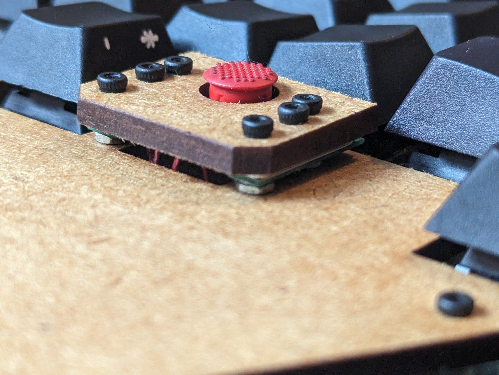

# Laser Prosthetic

This board's name pays homage to the line of trackpoint boards from [TEX](tex.com.tw/) that got me into mechanical keyboards, and the build log from [golem.hu](https://golem.hu) of the [Steel Tormentor](https://golem.hu/build-log/build-the-storm/) and it's cardboard prototype that got me into ergos and building myself.

## QMK

The `mkmods/qmk_firmware/keyboards/laser` directory contains my keymap. To flash,
- `git clone https://github.com/humanplayer2/mkmods`
- setup QMK in some directory (default is `$HOME`), then copy or symlink `keyboards/laser` there:
 ```ln -s `pwd`/mkmods/qmk_firmware/keyboards/laser $HOME/qmk_firmware/keyboards```
- enter bootloader mode by holding the top left button while plugging the board in, or by twice quickly shorting `RST` and `GND` on the ProMicro while plugged in (this way, stays in bootloader only 8 sec. I think)
- `cd <qmk-home>; make laser:default:flash` -- or `qmk flash -kb laser -km default`

I use **Custom Shift Keys** by Pascal Getreuer. He has a lot of other neat [QMK tricks, too](https://getreuer.info/posts/keyboards/triggers/index.html#when-mod-combo-is-held), [Achordion for homerow mods](https://getreuer.info/posts/keyboards/achordion/index.html).

## A Bit of Build


The board is build of laser-cut 3mm MDF and 1,5mm acrylic, and drawn in Inkscape, following tips found on [golem.hu](https://golem.hu).

**Importantly,** if you want to use the files included in `drawings` to cut for yourself, then the plate is drawn with 13,5mm holes, not 14mm, which fits Cherry MX switches. *On the laser I used, with the acrylic I used,* MX switches fit perfectly---but you should **make your own tests!**

The screw holes are for M2 screws.


The `/drawings` directory contains the design `.svg`, and the files from which the board was cut. If nothing shows when you open them, then in Inkscape, do: `View > Display Mode > Visible Hairlines`.



I hope to update this to a proper build log.

Bottom view, throught the bottom acrylic plate.


## Prototype

I did a cardboard prototype first, which I used for some weeks. While using it, I removed some keys that I found unpleasant to use. This photo is from after I migrated the trackpoint and promicro to the lasercut case.

For the prototype plate, I used 1,5mm cardboard ("træpap" in Danish, [like this](https://tuteinogkoch.dk/traepap-1-5mm-70x100cm)). I cut the plate using a scalpel, tracing a print drawn in Inkscape, fixed with needles. Around the edges of the plate, I used a 3x3mm wooden strip, like [like these](https://tuteinogkoch.dk/trae-liste-3-0x3-0x1000mm-lind). I used some of the wooden strip as support between columns too, but I think it was unecessary: at 3mm, the switch bottoms rest on the table anyway. I covered the bottom with some painters tape for minimal protection.


