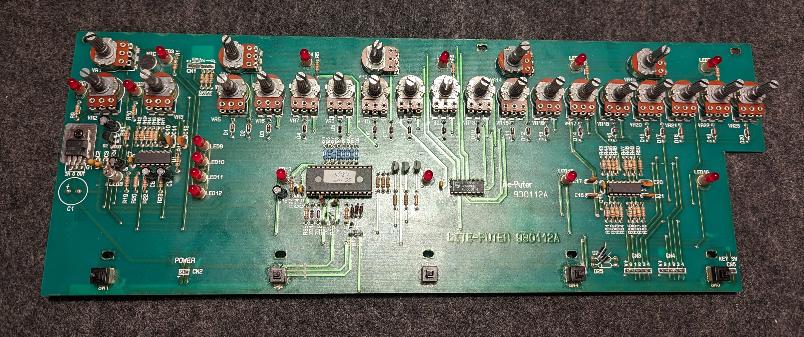
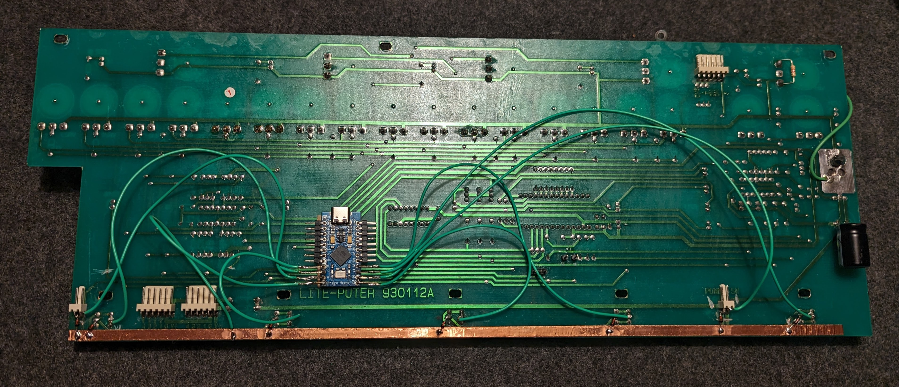

# Lite-Puter

A 5 pedal, 1 key, 1 toggle footpanel build on a Lite-Puter light control footpanel.

## QMK Flashing

QMK firmware is in `mkmods/QMK/keyboards/humanplayer2/liteputer`. To get in on the MCU, zero to hero:

- `git clone https://github.com/humanplayer2/mkmods`
- [setup QMK:](https://docs.qmk.fm/#/newbs_getting_started) `python3 -m pip install --user qmk`, then `qmk setup` and choose your `QMK_HOME`. Include submodules.
- copy or symlink `QMK/keyboards/humanplayer2` to `QMK_HOME`:
 ```ln -s `pwd`/mkmods/QMK/keyboards/humanplayer2 $(qmk env QMK_HOME)'/keyboards'```
- compile: `qmk compile -kb humanplayer2/liteputer -km default`
- flash:
  - `qmk flash -kb humanplayer2/liteputer -km default` (includes compilation)
  - when prompted, plug in the footpanel in bootloader mode:
    - enter bootloader mode by footing the left-most pedal while plugging the board in, or
    - twice quickly shorting `RST` and `GND` on the ProMicro while plugged in (quits bootloader after 8 sec. with this method)

## PCB front



As the board will be used under a desk, we do not make use of the many beautiful rotary encoders. We didn't even try.

## PCB back



## Build Notes

- We cut all traces to the switches and connectors we use, then wired a 1x7 matrix with diodes.
- The main row connection is a strip of copper tape.
- For MCU, we re-use a ProMicro from another project.
