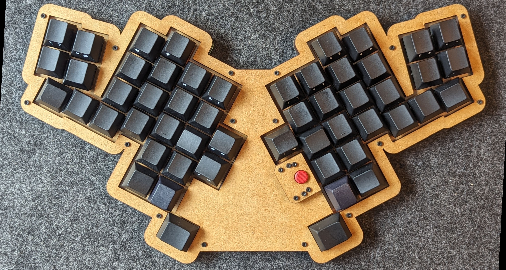
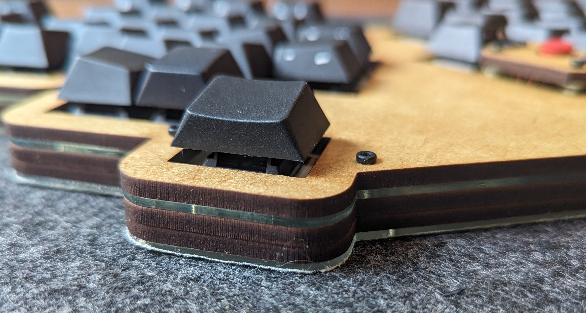
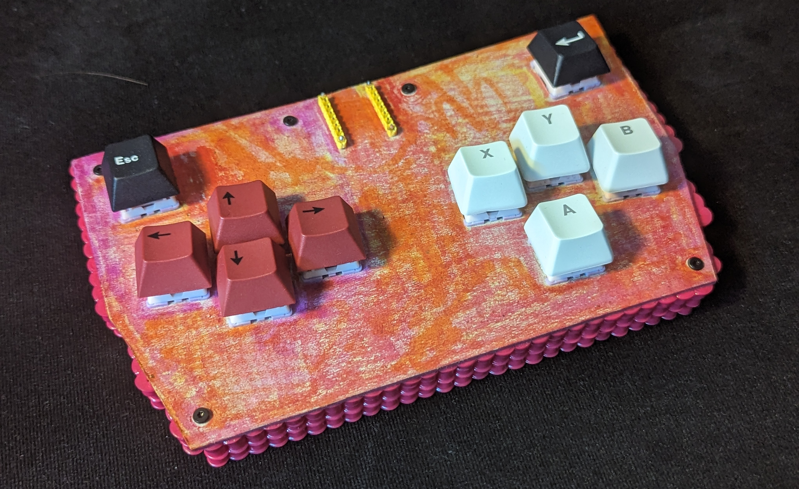
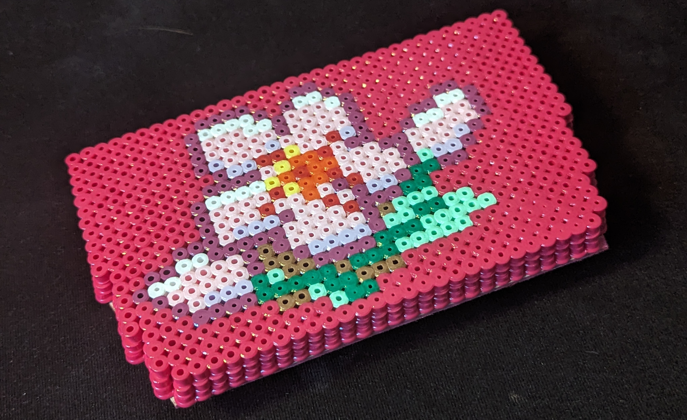
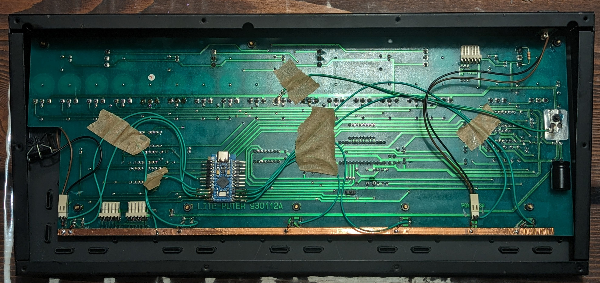
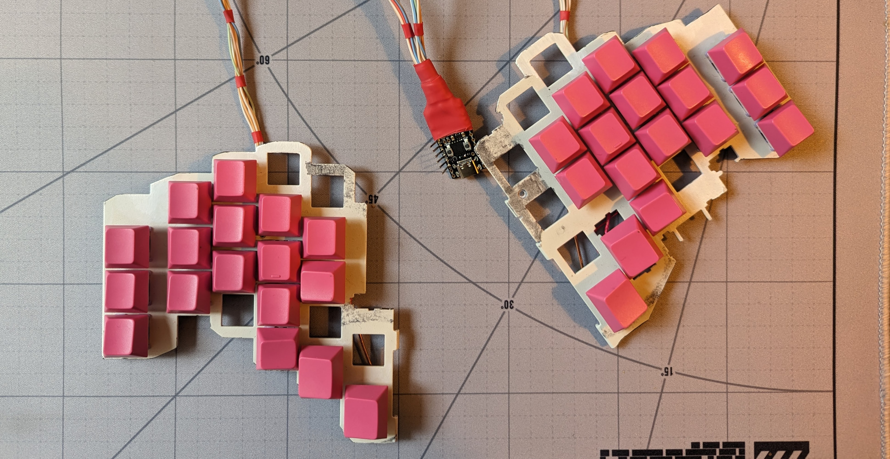
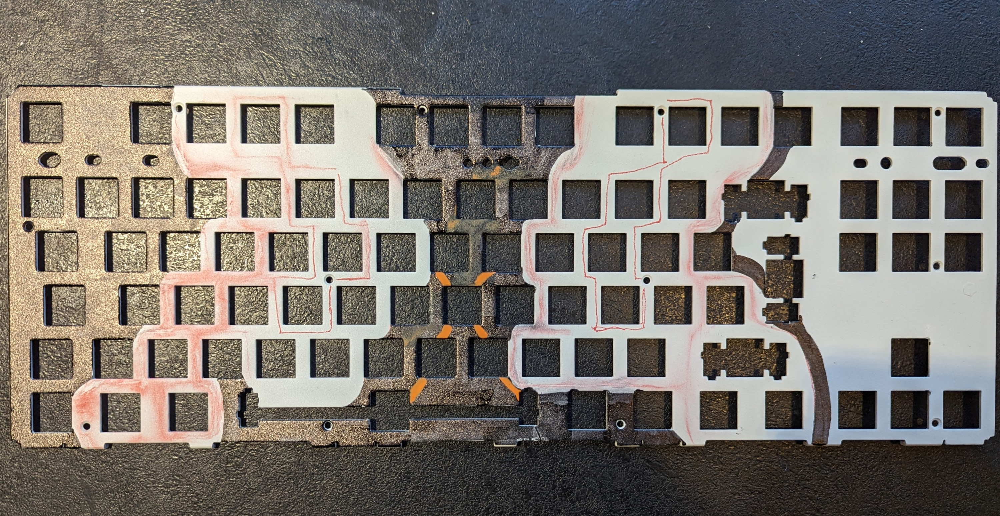

# Mechanical Keyboard Mods
 
Notes and photos of some of the boards and techniques I've fiddled with.  
> [3D Prints](#3d-prints) | [Building Techniques](#building-techniques) | [Ergogen](#ergogen) | [Mods](#mods) | [Misc](#misc)  
> [Homemade Boards](#homemade-boards) | [Premade Boards](#premade-boards) | [Reviews](#reviews)  

## Homemade Boards

- [LaserRaven: A 32+6 designed with nordic languages in mind.](homemade/laserraven/README.md)  
    My daily board: revision 1 and version 1  
     
- [LaserProsthetic: Trackpoint ergo laser-cut from acrylic and MDF](homemade/laserprosthetic/README.md)  
    Precursor to LaserRaven, laser-cut from acrylic and MDF.  
     
- [Frejas Hitbox: A gamepad made of Hama beads and cardboard](homemade/frejas/README.md)  
    Made for and with my toddler.  
     
- [Lite-Puter Footpanel: Light-controller rewired to run QMK](homemade/liteputer/README.md)  
    A friend wanted foot-modifiers, so we wired this light controller to a QMK MCU.  
     
- [Scraps34: A split build on a sawn TKL plate](homemade/scraps34/README.md)  
    When you've definitively destroyed the main chip on the PCB.  
      

## 3D Printing
- [1x1 MX plate test print](3dprint/1x1_mx_plate/README.md)
- [Silakka54 cases](3dprint/silakka54/README.md)
- [ThinkPad keycap MX stems](3dprint/thinkpad_mx_stems/README.md)
- [Comparision of JLC3DP SLA materials for keycaps](3dprint/jlc3dp_sla_keycaps/README.md)

## Building Techniques
- [Solder-free handwiring using WireGlue (tests)](techniques/wireglue/README.md)
- [Insulating handwired builds easily with acrylic paint](techniques/acrylic_paint_as_insulator/README.md)
- [A plate made of Hama beads](techniques/hama_plate/README.md)

## Ergogen
- [Script for running `ergogen .` on any `filename.yaml`](ergogen/ergogendot_on_any_filename)

## Mods
- [Spacebar with adhesive putty for deeper sound](mods/spacebar_with_adhesive_putty/README.md)
- [Hotswap mod using cheap rivets](mods/rivet_hotswap/README.md)
- [Heat shrink on stablizers to reduce rattle (didn't work)](mods/heat_shrink_on_stablizers/README.md)

## Misc
- [Gabrielle 7007L typewriter: MX useable keycaps](misc/Gabriel_7007L/README.md)
- [Retro-bright keycaps in the oven](misc/retrobright/README.md)

## Premade Boards
- [Tokyo60 w. Terminal keycaps: Notes on QMK/VIA](premade/Tokyo60/README.md)
- [ZUOYA GMK26: Teardown, VIA instructions](premade/Zuoya_GMK26/README.md)
- [ZUOYA GMK87: Notes on firmware and VIA]([premade/Zuoya_GMK87/README.md)
- [WIP: TEX Shura w. modified Cherry profile keycaps](premade/TEX_Shura/README.md)

## Reviews
- [AKKO 3068B (DK keycaps, sponsored)](premade/AKKO_3068B/README.md)
- [Dareu Cool 60 (sponsored)](premade/Darea_Cool60/README.md)
- [MUCAI MK61 (10$ complete hotswap 60% board)](premade/MUCAI_MK61/README.md)
