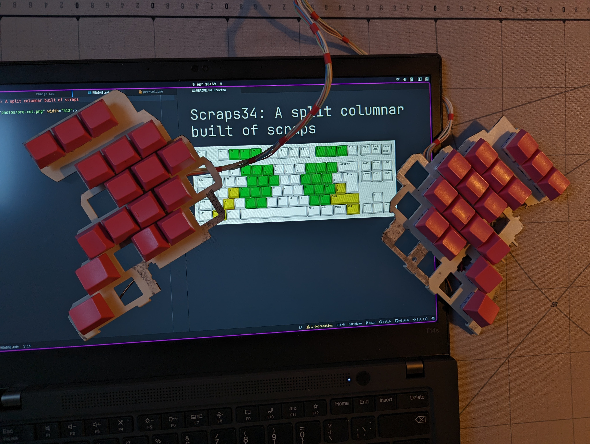

# Scraps34: A repurposed TKL split columnar

I managed to ruin the chip on an Xtrfy K4 TKL, and couldn't bring myself to throw out the case and plate. So I build this thing.

I tried to figure out a way to make the two sides symmetrical, but couldn't. So the stagger is uneven: the left fuck finger column is 1/2u higher than on the right. That annoys me to the degree that I never took the build serious.

When I [posted photos on Reddit](https://www.reddit.com/r/ErgoMechKeyboards/s/OdsSZ1Z3dI), I was pointed to [this proper build also reusing a plate by Oobly in 2013](https://geekhack.org/index.php?topic=49721.0). That's symmetric!

I had a plan to add a trackpoint or joystick on the right side, hence the extra switch holes. I had to figure something out firmware/hardware-wise for the trackpoint module I had lying around, and didn't get back to it.

The extra switch holes on top were meant for extra keys. The idea was to have three keys also on the inner column of the index finger, but because that alone would look silly, I'd balance that with a fourth key on the main index column. I didn't add those keys as they seemed a bit high for comfort.

Acrylic paint works as an isolator. That was easy.

The copper column wires are from inside the wall of an apartment I helped renovate. The row wire is just some random wire I had around. It was wound around a wooden stick and is conductive. The wires to the controller are from an ethernet cable.

