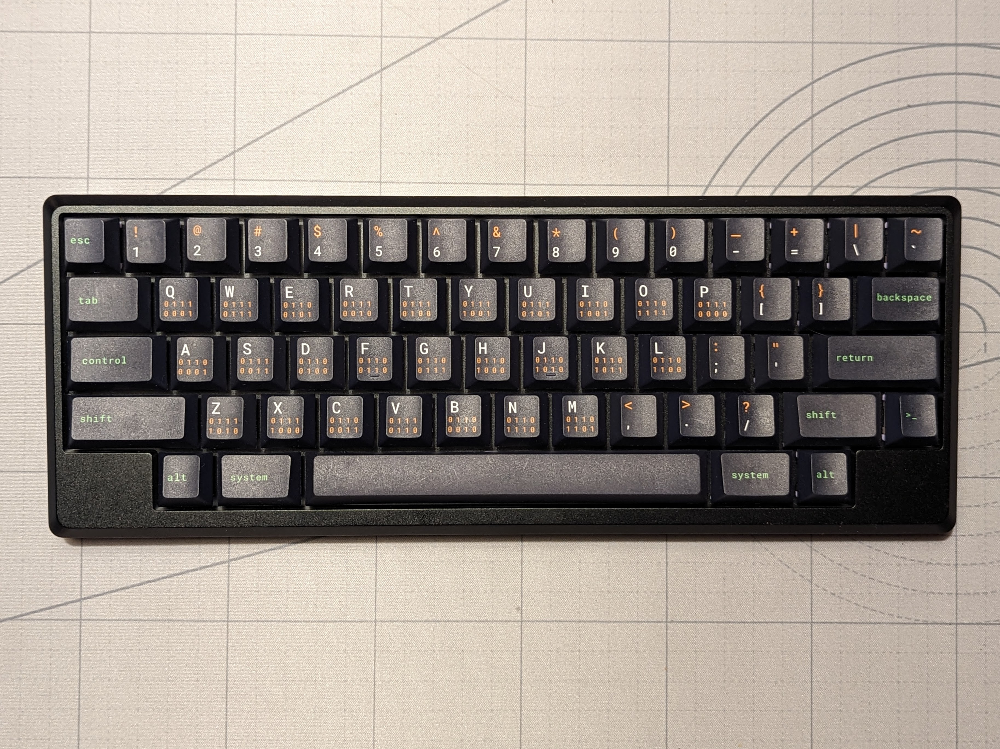
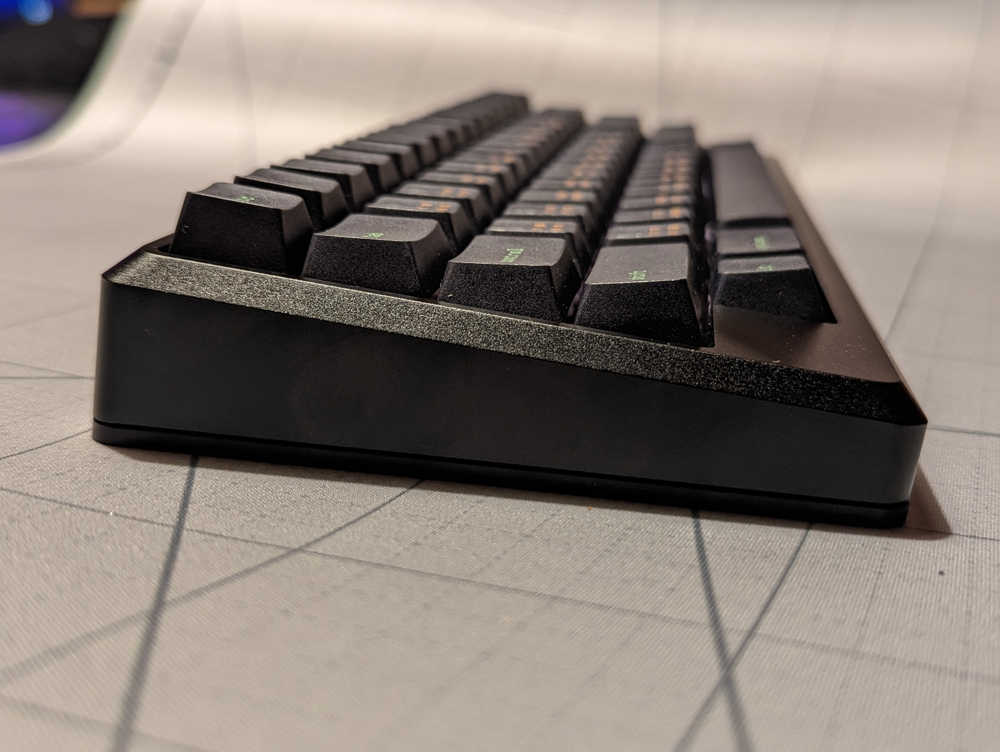
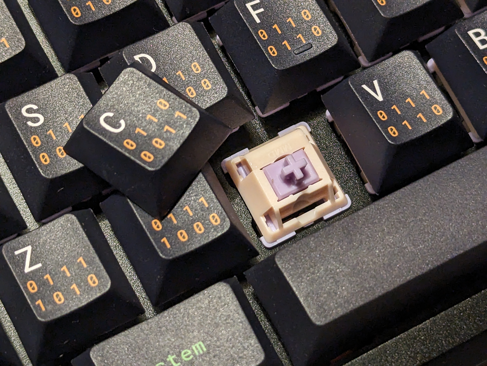

# Tokyo60: A HHKB layout board

[Documentation](https://github.com/JnyJny/tokyo60_keymap/tree/master/firmware).

Build and sold with qPBT Terminal keycaps and MMD Princess linear switches. More photos below.

## To flash and run VIA
- Download and setup QMK
- Plug in the board and to enter bootloader, press `left shift + right shift + B`
- Run `qmk flash -kb tokyokeyboard/tokyo60 -km via`
- Open `usevia.app` in browser (Chromium).
  - Got _Received invalid protocol version from device_. [Per this comment](https://github.com/the-via/releases/issues/257), I accessed `chrome://device-log/` and saw `Failed to open '/dev/hidraw1': FILE_ERROR_ACCESS_DENIED`. Running `sudo chown $USER:$USER /dev/hidraw1` solved problem.

