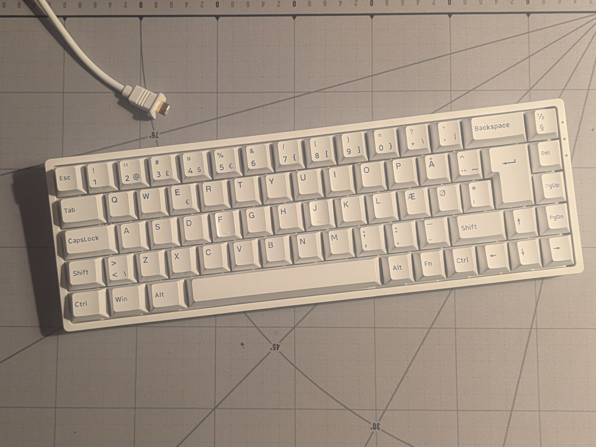
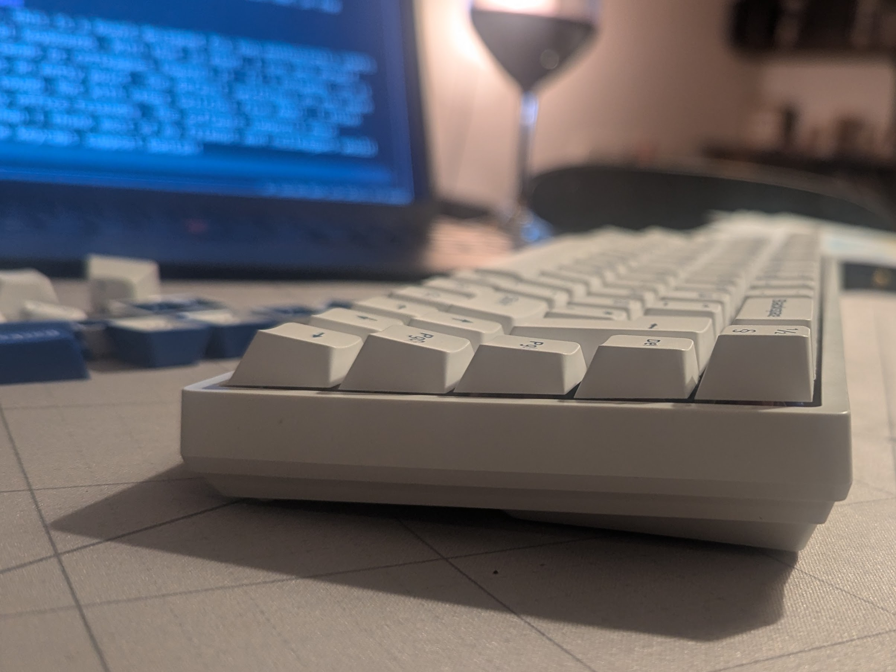

# AKKO Blue on White 3068B Plus ISO

AKKO was kind to send me a box containing their not-new 3086B 65% board for review, together with their tactile 55gf Creamy Purple Pro and their linear 40gf Rosewood switches.

Everything here is of course just my opinion, so you can prefix every sentence with "IMHO" if you like.

There are some thing I don't care much about myself, and therefore know little about. About these, I'll stay quite. These include RGB, stability of bluetooth and 2.4G connections, battery life. If you curious about something, then let me know.

To see box content, the extra UK/DE/FI/SE/NO andvanity keycaps, further specs, etc., see the [keyboard product page](https://akkogear.eu/products/blue-on-white-3068b-plus-iso-mechanical-keyboard?_pos=2&_sid=636572fe2&_ss=r).

## Case
For a plastic case board, it'd nicely heavy, weighing in at 645g on my kitchen weight. It's stiff, and doesn't feel cheap. I think for casual user of mechanical keyboards, the build quality will be very satisfying. The case is compact, and not with a design I'd be annoyed at having around.

To open the case, you need to pry off the top, then remove screw located under Tab, I-O, and Return. The the plate-and-pcb assembly lifts out, ready for e.g. a Tempest tape-mod.

## Inside
Opening the case reveals a ~3mm low-density foam sheet, and the 18mAh battery. I measured the steel plate to be 1.5mm thick, the thickest that Cherry MX switches will fit. That's nice as it ensures that the switches sit tightly.

There's not much empty space in the case.

I was hoping to learn something about the MCU model, but no luck. It just reads "Akko". Fair enough, but it voids my hopes that I could maybe port the board to QMK/SonixQMK. At least it make it tricky, since I don't know what the MCU model is... I'd like to port QMK because QMK is awesome, and the Akko software for this board is more limited. I'll get back to that.

## Out-of-the-box typing experience
The board came with 45g Akko CS Jelly Pink linear switches. I'm a tactile fan myself, so I won'd say much about these. I think the feel finely smooth, as I can't feel any scratchyness. I'm not too crazy about their sound. They are a bit light in sound for me, and on the upstroke, they sound clattery. I could type on this for a long without getting straight-up annoyed, but it'd not pelasing either. I wouldn't be comfortable using it at the office.

I'm impressed by the stabilizers and their lubrication. Only the left side of the spacebar had any kind of rattle, and I don't think the others are overlubed. The stabilizers can be removed without opening the board, so I reworked a bit of the lube from the right side of the spacebar stabilizer to the left, and that largely solved the rattling. I then added dash of dielectric grease again only to the left side of the spacebar, and now I'm satisfied with all the stabilizers.

The keycaps are Cherry-profile, and have a bit of texture. I'm used to Cherry, and I like the texture.

## Keycaps
The keycaps are double-shot PBT, and I measure them to 1.2mm, so not thin, and not the thickest.

I want to praise the keycaps for their regional support options, but also criticize them a bit for their legends.

First, the praise: They support Danish, not just Nordic.

This is Nordic:

This is Danish:

See the difference?

For context, here's a rant: I'm Danish. We have ÆØÅ in our alphabet. The Norwegians have the same, but flip Æ and Ø in their layout. The Finnish and Swedes also have ÆØÅ, but write them ÄÖÅ. Now, somebody got the great idea that they could lump all three languages into a Nordic keyboard layout, where the Danish Æ key could feature the legends Æ from Danish, Ø from Norwegian and Ö from Finnish/Swedish, while the Danish Ø key could have legends ØÆÄ. It's atrocious. Now look at the key to the right of backspace. WTF goes on there? If you go exploring further, find pipe---both of them. If you don't use accents and pipe/backspace often, how annoying is it that? Nordic layout is an abomination, a slap in the face, unforgivable. Keychron, I'm looking at you.

AKKO, thank you for not using the Nordic layout, but supporting Danish, Norwegian and Finnish=Swedish! For me, this makes a huge difference. This is definitely a thing I'll mention when pointing other Danes to keyboards brands.

Now, to the criticism: The legends are not the most consistent that I've seen. Individually, they are all clean, clear and precise, but they are not fully consistent. I think this is most noticable one the Danish keys, when compared to the others, where Ø is thinner than the other alphas, and E, Æ and Å are wider. The trextr on some of the modifiers is also a bit inconsistent in width (on the left Win key, "in" is narrower that other mod text).

All-in-all, given the choice between a nicer, Nordic layout keycap set or this Danish one with slight inconsistencies, I'd most assuredly go for this one. I'd also be satisfied with the legends given the overall price of the board.

## Creamy Purple Pro and Rosewood switches: Sound
Uhh, the sound of these Rosewood linears is quite nice! Very much an improvement. Much softer, rounder, and also quiter than the Jelly Pinks. No clattering. With these, I think the board could be used in the office where even my most noise sensitive colleague would have to agree that the board makes an "objectively" acceptable level of noise. I'd be glad to hear a colleague tap away!

The Cream Purple Pros: I think the are about as loud as the Jelly Pinks, but cleaner in their sound profile. They don't have that clattering. The sound is well-defined, clean and clear on both up- and downstroke. Not super deep, but rounded. I'd be happy with this sound.

Ok, thinking about the tactility, I just had to throw in a few Gazzew U4Ts (spring swapped to 55gf), which are what I normally use. The Cream Purple Pros feel like they have slightly smaller tactile bump, but its position feels the same as the U4Ts. Sound-wise, the U4Ts sound a bit louder and deeper to me. I think I could be happy with these switches, and will try them in my main board.

## Software and Firmware
Board and firmware are not made for remapping and layering enthusiasts. I'm a QMK + thumbkeys + lots-of-layers person, so I'm biased towards that here.

In the AKKO software, you can define four layers, which you can cycle between on Fn+Right_Alt (that could have been mentioned in th manual...), plus two Fn-layers.

The four cyclable layers are fully free, so there you can play. But, you need to cycle thorugh them. You can't hold them and momentarily activate a layer. But the Fn-layers allow that. On the first Fn-layer some keys have locked functions for F1-F12, media keys, RGB, etc., but the second Fn-layer is fully free! I think this is really  nice. It means you can remap CapsLock to activate a full layer with macros and what not, and that I really appreciate.

More advanced things---like tap-hold etc.---are not in the picture.

## Conclusions
So, clearly, this is a board designed for non-enthusiasts users of mechanical keyboards. With that in mind, I can see myself pointing friends or colleagues towards it. It's hotswap, so it can serve as an entry point. The default swithches do not have the nicest sound, but with other switches from AKKO, I think it's totally office-friendly. The software supports more functions than I think most of my friends and colleagues would use. And the keycaps support Danish!