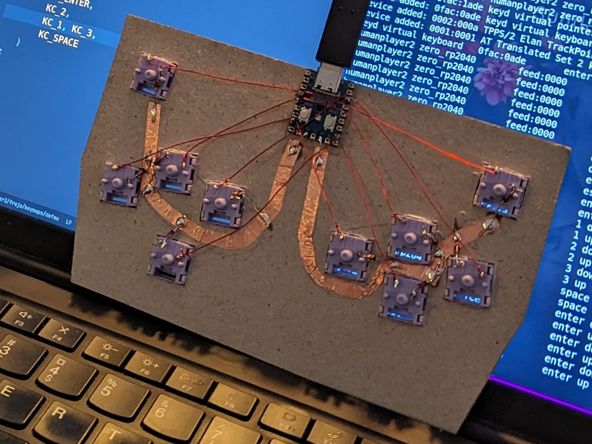
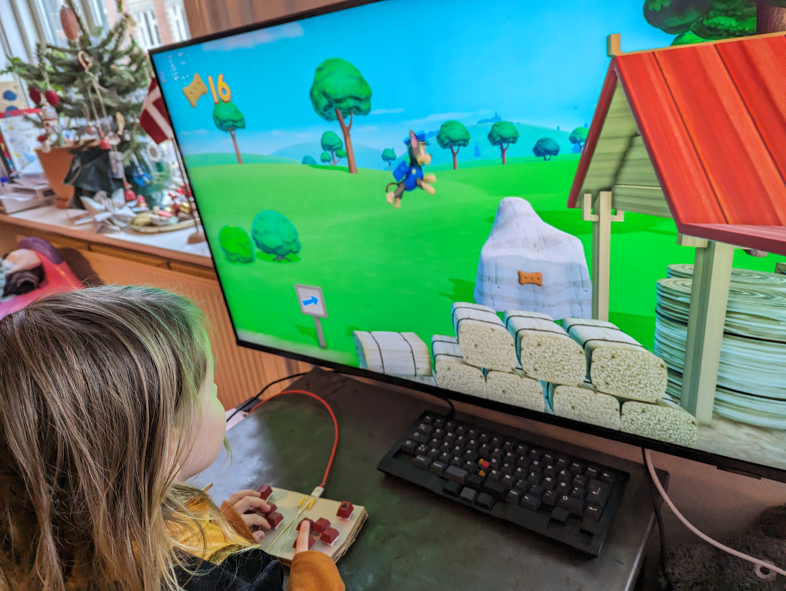

# Frejas Hitbox

I hope to entertain my toddler daughter, Freja, with playing some basic platformers, and thought that it might help her have fun if she had her own board with just the keys she'd need. Specifically, these are the keys needed for *Paw Patrol: On a Roll!*, recommended by another father from the kindergarten.

## Build

### Friday

#### Plate, Switches, MCU
The plate is a piece of 1.5mm sturdy cardboard for model building. I drew and cut it by hand while she was building Legos on the same table.

For the cut-outs, I used a printed sketch from another project. The square is 14x14mm. I makred out the corners with a needle, then cut between the dots with a scalpel.

I planned to angle the right cluster outwards, but my focus was somewhat split.

She helped place the switches.

I did the soldering after her bedtime. The MCU is an RP2040 Zero. It's held to the plate by pins, some of which I sodlered to the MCU. I punched wholes in the plate with the needle, then stuck through the pins and placed those yellow what-are-they-called_s. On top, on the ned pins, I added a blob of solder so things can't slide apart.

For the columns, I used copper tape.

#### Cardboard Case

To get something working quickly, I made a cardboard case: three layers of cardboard, glued together with glitter glue.

#### Keycaps

For keycaps, she wanted red, but alas, the red keycaps I had had nordic runes as secondary characters, so she got some cheap `A,B,X,Y` keys, instead. And then black `Esc` and `Return` as I had some 1u's of those.

### Saturday

While she played with Legos, I did the QMK setup.

Later, we bought some HAMA beads for home, as it's an activity she loves in kindergarten. We played/designed with those, and I learned how to iron them.

She also got to play on the cardboard case.

She hit a steep learning curve playing *Paw Patrol*. I learned that pressing `jump` and `right` simultaneously is an aquired skill. We had fun.

#### Bead case
I did the bead case Saturday night, while she slept. I looked up flower designs online, and freestyled a bit from one of those.

To keep the layers together, I just forced M2 screws through the holes of the beads.

### Sunday
We jointly colored the plate with pens that could have been fresher 😅

### Later

She'd played some, and fun with it, but it's not something she particularly asks to do. She improved a lot.
