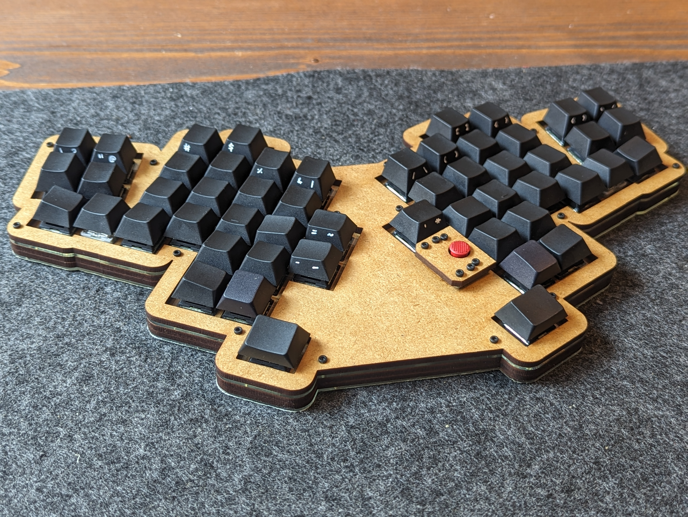
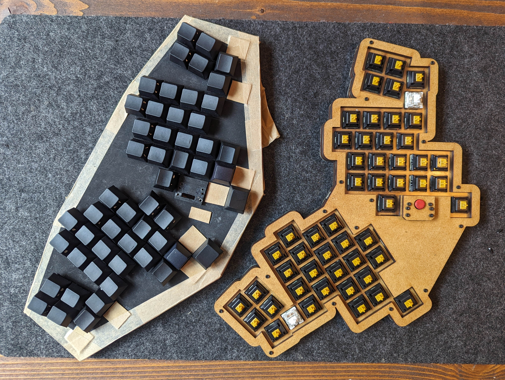

# LaserProsthetic

This board's name pays homage to the line of trackpoint boards from [TEX](tex.com.tw/) that got me into mechanical keyboards, and the build log from [golem.hu](https://golem.hu) of the [Steel Tormentor](https://golem.hu/build-log/build-the-storm/) and it's cardboard prototype that got me into ergos and building myself.

## Firmware: QMK
[My QMK fork](https://github.com/humanplayer2/qmk_firmware) contains the firmware, in the `humanplayer2` branch, under `keyboards/humanplayer2/laserprosthetic/`.

The README there contains flashing instructions.

### Used features
I use **Custom Shift Keys** by Pascal Getreuer. He has a lot of [other neat QMK tricks](https://getreuer.info/posts/keyboards/triggers/index.html#when-mod-combo-is-held), too, including [Achordion for homerow mods](https://getreuer.info/posts/keyboards/achordion/index.html).

I use Linux Trackpoint middle-mouse scrolling: Enabled by the keyboard name end in `Trackpoint`.

## A Bit of Build

- The board is build of laser-cut 3mm MDF and 1,5mm acrylic, and drawn in Inkscape, following tips found on [golem.hu](https://golem.hu).

- The files for cutting is in `/drawings`. The plate is drawn with 13,5mm holes, not 14mm (which fits Cherry MX switches on paper). With the laser and acrylic I used, 13,5mm fit MX switches perfectly. The screw holes are for M2 screws.

- The `/drawings` directory contains the design `.svg`, and the files from which the board was cut. If nothing shows when opening them, then in Inkscape, do: `View > Display Mode > Visible Hairlines`.

Bottom view, throught the bottom acrylic plate.

## Prototype

I did a cardboard prototype first, which I used for some weeks. While using it, I removed some keys that I found unpleasant to use. This photo is from after I migrated the trackpoint and promicro to the lasercut case.

For the prototype plate, I used 1,5mm cardboard ("træpap" in Danish, [like this](https://tuteinogkoch.dk/traepap-1-5mm-70x100cm)). I cut the plate using a scalpel, tracing a print drawn in Inkscape, fixed with needles. Around the edges of the plate, I used a 3x3mm wooden strip, like [like these](https://tuteinogkoch.dk/trae-liste-3-0x3-0x1000mm-lind). I used some of the wooden strip as support between columns too, but I think it was unecessary: at 3mm, the switch bottoms rest on the table anyway. I covered the bottom with some painters tape for minimal protection.

