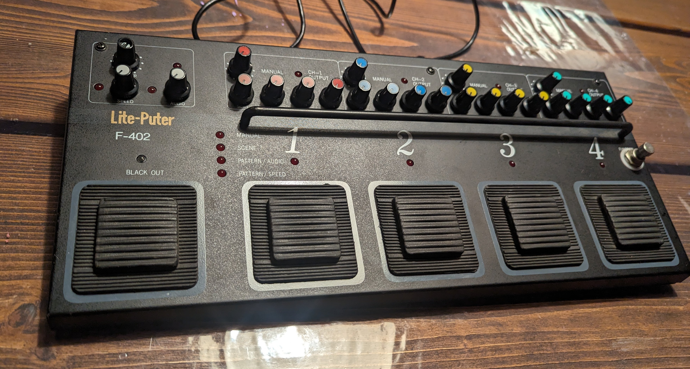

# Lite-Puter

A 5 pedal, 1 key, 1 toggle footpanel build with a friend on a Lite-Puter light control footpanel, for said friend.

[Build](build)
[More photos](more-photos)
[QMK flashing](qmk-flashing)

## Build

The five foot-buttons, as well as the silver button on the right and the 0/1 toggle on the back are set up as buttons.
We did not try to make use of the many beautiful rotary encoders.

### Fails: Cherry G81-3000 Multiboard Controller
We first tried hooking the pcb to the controller board from an old Cherry G81-3000 Multiboard, reusing some pcb routes. The controller board worked fine when we just shorted pins on it, but became unresponsive after we triggered some keypresses when it was wired to the Ligth-Puter pcb. Who knows what parts of the pcb we send those signals through... We tried the same with another such controller, with the same result.

*PCB front*

### Success: ProMicro
Following the fails, we cut all traces to the switches and connectors used, then handwired a 1x7 matrix with diodes. The primary row connection is a strip of copper tape. Not the first time I use it. Good stuff!

We hooked that matrix up to an older generation ProMicro, on which we flashed QMK. The ProMicro is just stuck to the pcb with a bit of double-sided tape. To not pull at it with the USB cable, we gave the latter a knot on the inside of the case.

*PCB back*

## More photos

*A switch close-up. They are clicky. On top, you place a rather small flat keycap, which is then directly under the foot-button rubber.*

*Case top. The five foot buttons and the silver button to the left are on the matrix.*

*I envy the* "*Black out*" *key*.

*Case back. The 0/1 toggle is on the matrix.*

## QMK Flashing
[My QMK fork](https://github.com/humanplayer2/qmk_firmware) contains the firmware, in the `humanplayer2` branch, under `keyboards/humanplayer2/liteputer/`.

To get it onto the MCU, zero to hero:

- Clone `https://github.com/humanplayer2/qmk_firmware` to your home directory.
- [setup QMK:](https://docs.qmk.fm/#/newbs_getting_started) `python3 -m pip install --user qmk`, then `qmk setup`. Include submodules.
- compile: `qmk compile -kb humanplayer2/liteputer -km default`
- flash:
  - `qmk flash -kb humanplayer2/liteputer -km default` (includes compilation)
  - when prompted, plug in the footpanel in bootloader mode:
    - enter bootloader mode by footing the left-most pedal while plugging the board in, or
    - twice quickly shorting `RST` and `GND` on the ProMicro while plugged in (quits bootloader after 8 sec. with this method)
