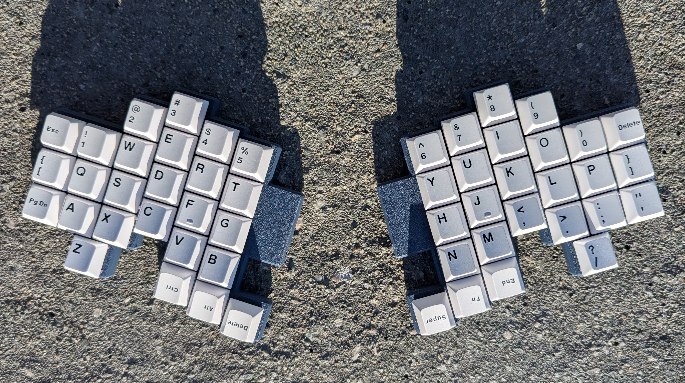
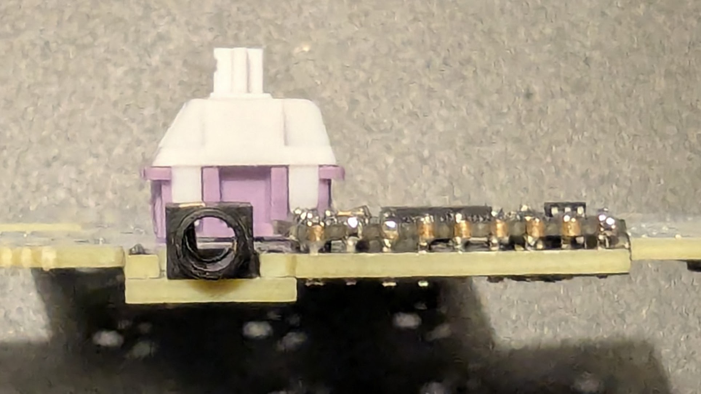
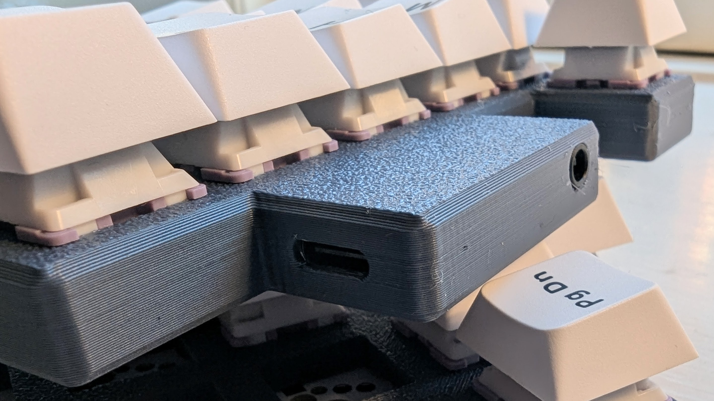
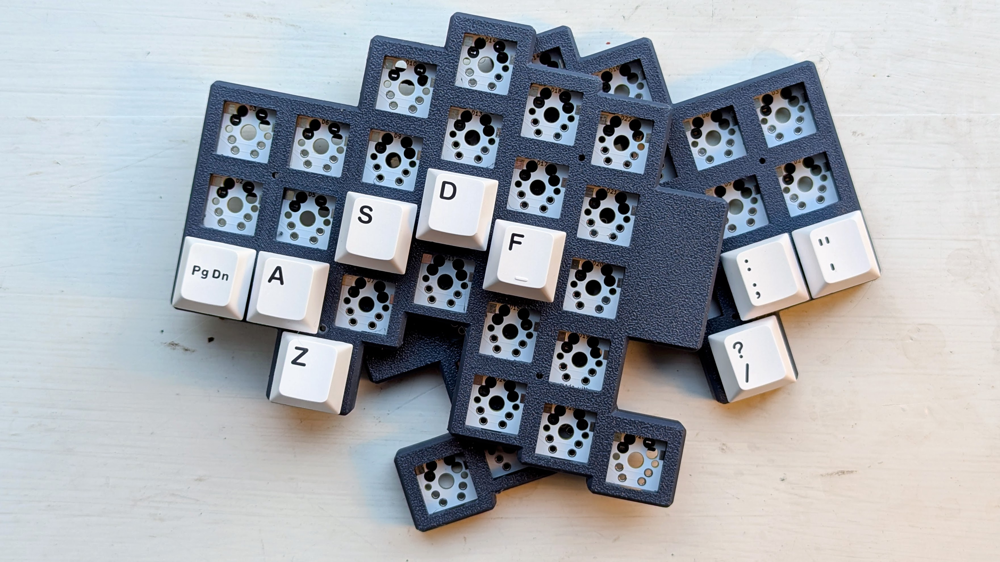
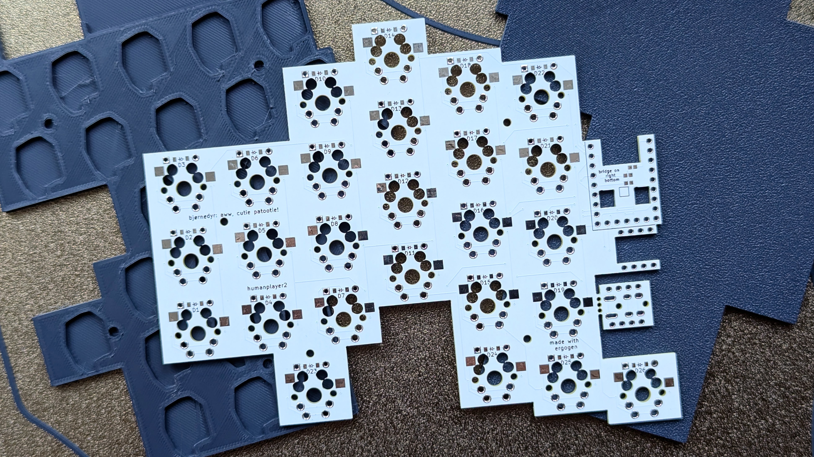
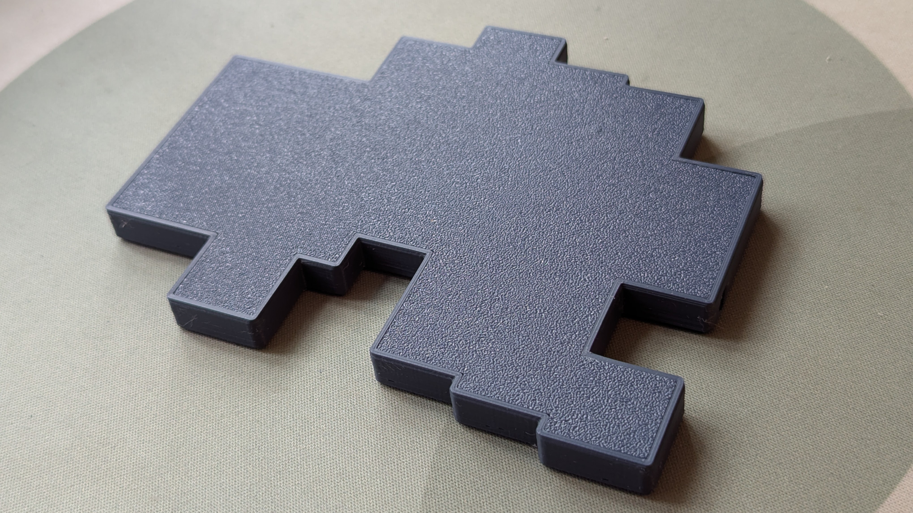

# Underset

Underset is a spartan 52-key column-staggered split keyboard with
- aggressive pinky stagger and keys partially underset the ring column for a three-key curved pinky cluster
- both RP2040-Zero and TRRS underset the switch plate for simple cases that still isolates the electronics

> [!NOTE]
> This was written for the TRRS v1. I've now made a v2 with USB-C.
> See the [repository on Codeberg](https://codeberg.org/humanplayer2/underset/)

    

    
    

Underset is in the family of 4-row column-staggered split keyboards, like e.g. 
[Dygma Defy](https://dygma.com/products/dygma-defy), 
[Elora](https://splitkb.com/collections/keyboard-kits/products/halcyon-elora), 
[Go60](https://www.moergo.com/pages/go60), 
[Iris](https://keeb.io/collections/iris-split-ergonomic-keyboard), 
[Lily58](https://github.com/kata0510/Lily58), 
[Silakka54](https://github.com/Squalius-cephalus/silakka54/), 
[Sofle](https://josefadamcik.github.io/SofleKeyboard/),
[ZSA Voyager](https://www.zsa.io/voyager), and 
[many others](https://yal-tools.github.io/ergo-keyboards/?keys=50~60&sort=-Name%20%26%20photo). 

This family contains both the luxurious, the feature-rich, and the unadorned. Underset falls in the latter category, inspired by the wonderfully simple [Silakka54](https://github.com/Squalius-cephalus/silakka54/).

Underset made simple to keep sunk costs low to avoid lock-in: else finding the ergo that's right for you can be very expensive.

## Layout

Somewhat special to Underset is its underset pinky keys that result in an curvy-horizontal three-key pinky row/cluster.

       
    <code>PgDnAZ</code> pinky cluster and <code>ASDF</code> homerow   
       

Underset thus combines the underset keys from the [jklp (30+6)](https://github.com/brow/jklp) and [LaserRaven v.1.1 (32+6)](https://github.com/humanplayer2/mkmods/tree/main/homemade/laserraven) with the outreaching pinky cluster of boards like the [Azimuth (40+6)](https://golem.hu/page/azimuth), [Balbuzard (30+8)](https://github.com/brow/balbuzard), [Osprette (30+4)](https://github.com/smores56/osprette), [Totem (32+6)](https://github.com/GEIGEIGEIST/Totem), [vulpes (30+6)](https://codeberg.org/ravnheim/vulpes) and [Wubbo (30+6)](https://github.com/cacheworks/Wubbo).

Underset shares a straight thumb cluster design with e.g. the [Jian](https://github.com/KGOH/Jian-Info), [KOMETA](https://github.com/inpudiy/KOMETA) and [LaserRaven](https://github.com/humanplayer2/mkmods/tree/main/homemade/laserraven).

## Features

- Vial/QMK firmware: see the [firmware information](https://codeberg.org/humanplayer2/underset/src/branch/main/firmware)
- Reversible PCB combined with lowered controller and TRRS for print-flat-on-plate mirrored [case designs](https://codeberg.org/humanplayer2/underset/src/branch/main/cases)
- Hand-solderable: see the [build guide](https://codeberg.org/humanplayer2/underset/src/branch/main/build_guide)
- Designed with Ergogen: see the [Ergogen notes](https://codeberg.org/humanplayer2/underset/src/branch/main/ergogen)
- 1u keycap compatible (alphas from 60% ISO / 60% ANSI +1 R2)

      
    My daughter fell in love with a tardigrade plush once. 
    The face of Underset is not as cute.
       

## Questions
- See the [repository on Codeberg](https://codeberg.org/humanplayer2/underset/)

    

## Thanks

- Without [Ergogen](https://ergogen.xyz/) and its community, I would still be handwiring. See the [Ergogen notes](/docs/ergogen.md) for information on Ergogen and the resources instrumental in designing Underset's PCB.
- [PCBWay](https://www.pcbway.com/) generously offered support for PCB production, for which I am very grateful. See my [PCBWay review](https://github.com/humanplayer2/mkmods/blob/main/ergogen/pcbway_review.md) for information about ordering PCBs from them.
- Without [QMK](https://qmk.fm/), [Vial](https://get.vial.today/) and their community, I would not have gotten into building keyboards.
