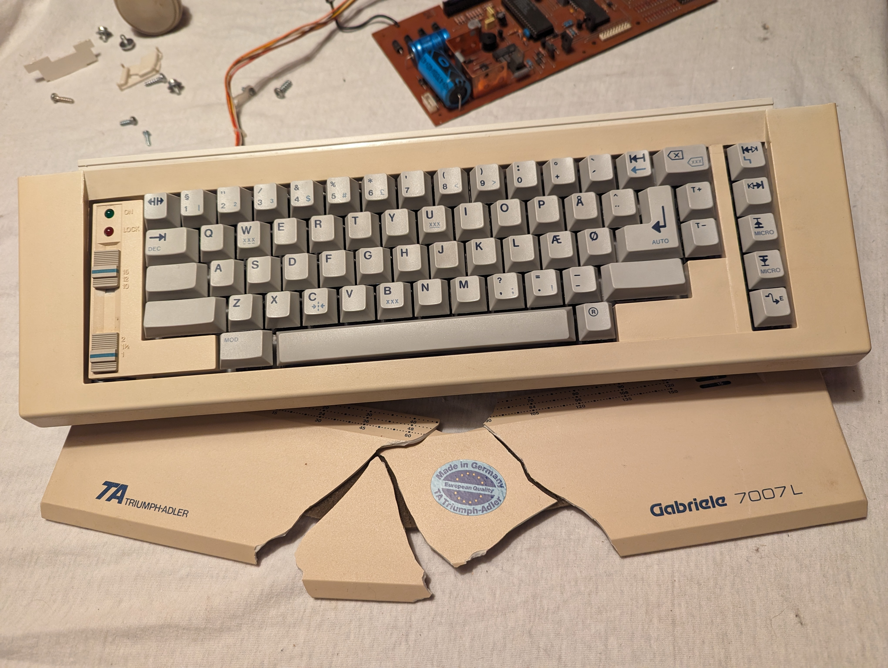
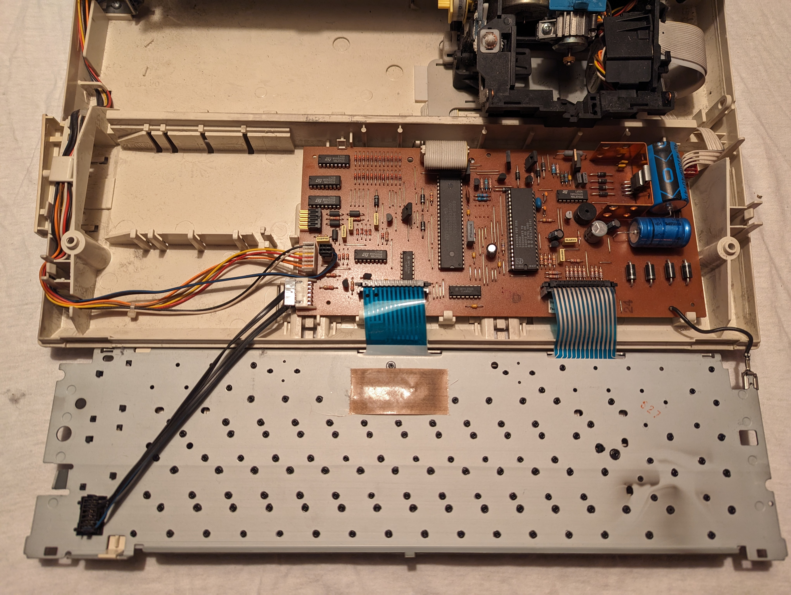

# Gabrielle 7007L Typewriter

I found this beautiful Gabrielle 7007L typewriter with nicely thick, largely MX compatible Cherry profile dye-sub keycaps in Danish.

It has Cherry MY switches. The stablized keycaps ones have these white adapters for the switch-mounted stabilizer pins. The adapters sit in MX plus shape mounts in the keycaps.

If I could replace the switches, I might take this part and wire it to an MCU, but the MY switches are simply too lousy for it to be worth the effort.

### Resources on typewriters with compatible keycaps
- [geekhack.org topic](https://geekhack.org/index.php?topic=90232.0)
- [google spreadsheet](https://docs.google.com/spreadsheets/u/0/d/19UCdgpzgFKxGdhGBXevc7OxsyMYAmwKew-pMzkjfXtI/htmlview?pli=1)
- [deskthority.net wiki on Triumph-Adler](https://deskthority.net/wiki/Triumph-Adler)

### More photos

