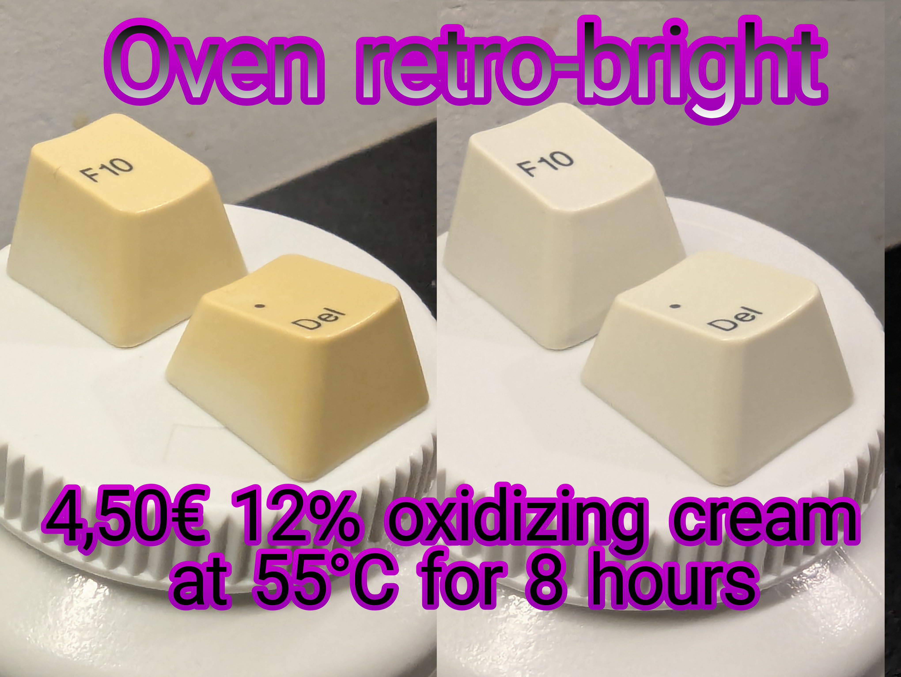
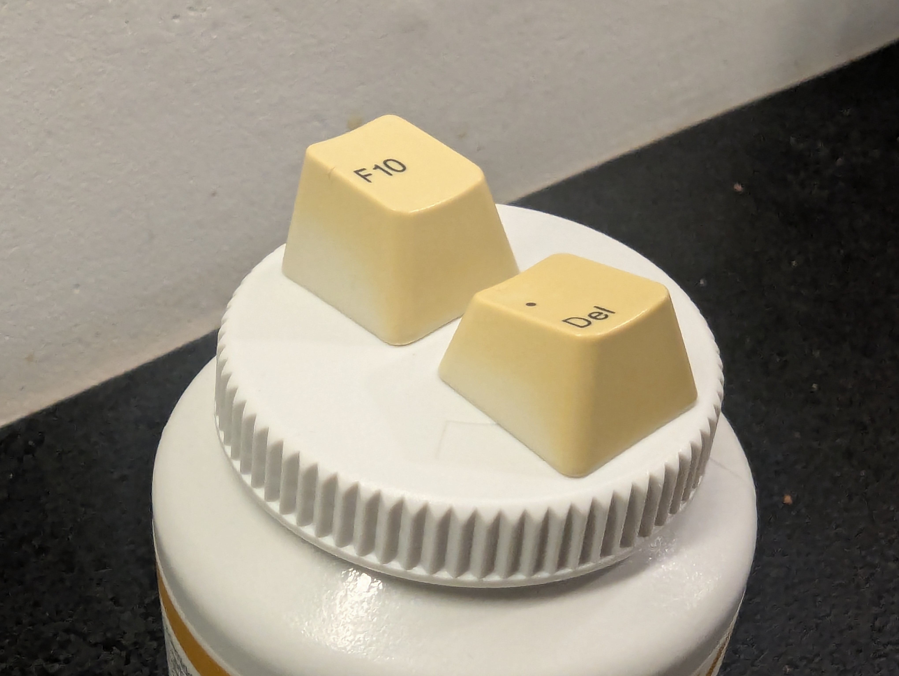
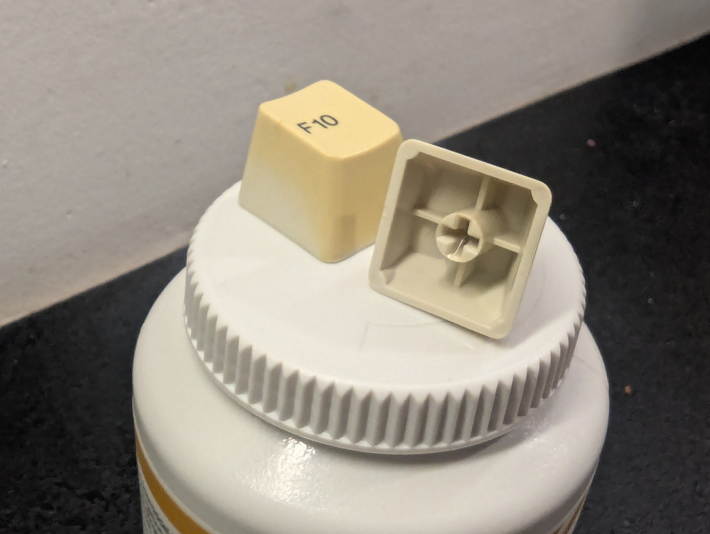
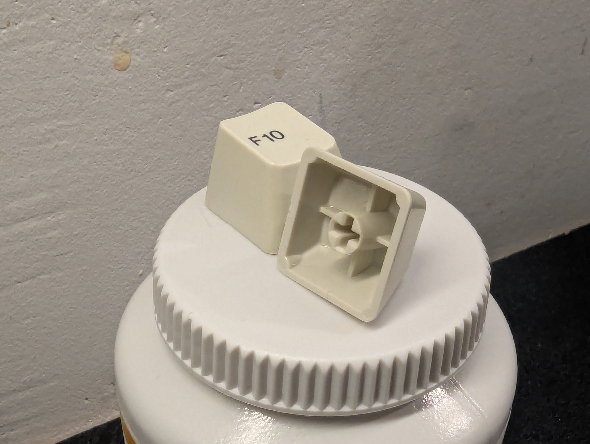
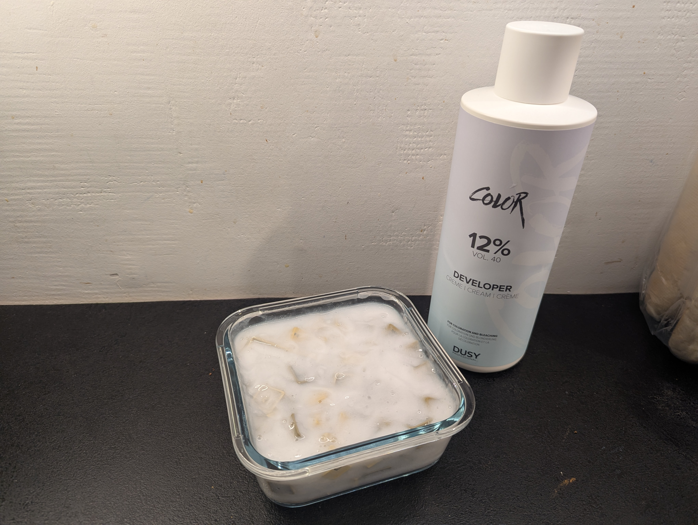

# Oven retro-bright of DYTCOM K-261 keycaps 

> [r/mk post](https://www.reddit.com/r/MechanicalKeyboards/comments/1qntnph/oven_retrobright_of_dytcom_k261_keycaps/?utm_source=share&utm_medium=web3x&utm_name=web3xcss&utm_term=1&utm_content=share_button)

I posted a pretty tired-looking DYTCOM K-261 the other day: https://www.reddit.com/r/MechanicalKeyboards/s/lw4PQbpLpy

  

  

Now I've retro-brighted the keycaps.

  

  

Earlier, I've retro-brighted with hydrogen peroxide plus Vanish as catalyst, but I learned of a hair-dresser supply store a walk from my house that sells 12% cream developer / oxidizing cream for 67 DKK a liter. That's around 9 euro or 10,50 united states dollars. I used around half.

I've only used my oven. Denmark is short of UV light in the winter, I think. And I don't have a garden.

I was a bit lazy and didn't try to save on the cream: I just drowned all the keycaps in it, pre-heated the oven, and gave them 8 hours at 55°C. No tests, no regrets.

  

After 4 hours, they already looked quite good, but I left them in there. The oven turned off after 8 hours, but I was a sleeping, so they spend the cool down time in there, too.

  

Yeah, so that was pretty easy :)
