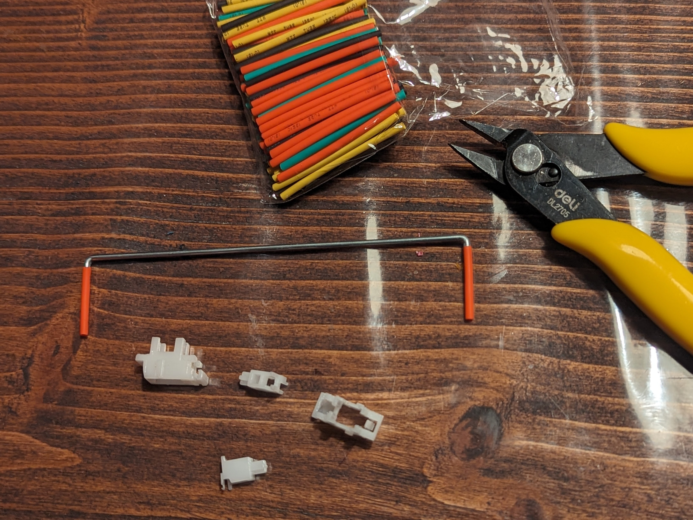
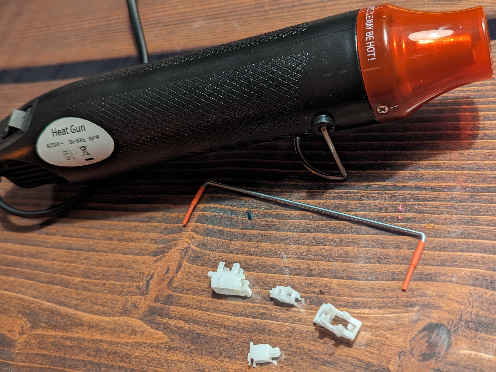
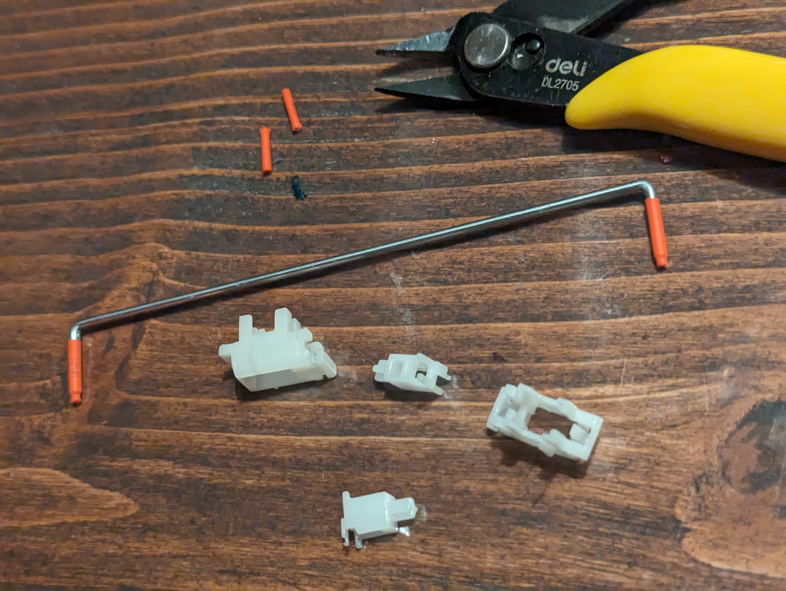
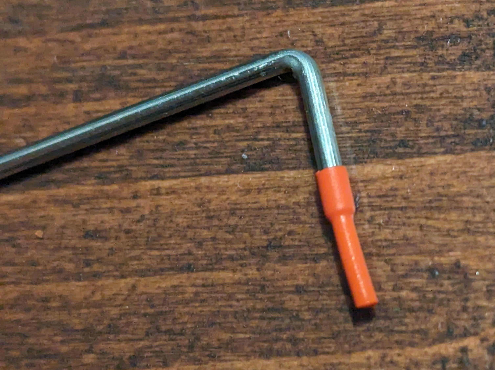

# Heat shrink on stablizers to reduced rattle

## TL;DR
I tried fixing stabilizer rattle with heat-shrink. It didn't work. 

## Long form
On some extremely rattly, totally unlubed stock stabs from an Xtrfy K4, I tried adding heat-shrink tubing. 

I hoped it stop the the metal-against-hard-plastic rattling, in an easy, reproducible, non-greasy way.

As the photos show, I tried with both a longer and shorter tubing. Both lengths just got stuck in the stab housing. I tried adding a bit of lube, but it made no difference.

So yeah. Negative results are results, too, right?

I [posted about it on r/mk](https://www.reddit.com/r/MechanicalKeyboards/s/3jrscCEi3I), where there's some discussion.

 

