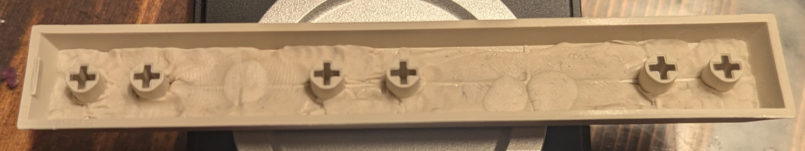

For a deeper sounding spacebar, I like adding adhesive putty.

I take small lumbs and press them directly into the spacebar. There are typically some "support walls" on the underside. I fill up to the edge of those. Then there's no interference with switch and stabilizer.

I use various things to push it into place: fingers, cue-tips, a pry tool.

I find putty easier and more effective than filling them with rolled up painter's tape or cutting pieces of foam.

It's not too difficult to remove.

[I use this stuff](https://www.harald-nyborg.dk/droppen-elefantsnot-50-g). There are tons of versions out there. Try searching for `removable reusable mounting adhesive sticky putty` and show the results in your local office supply store.