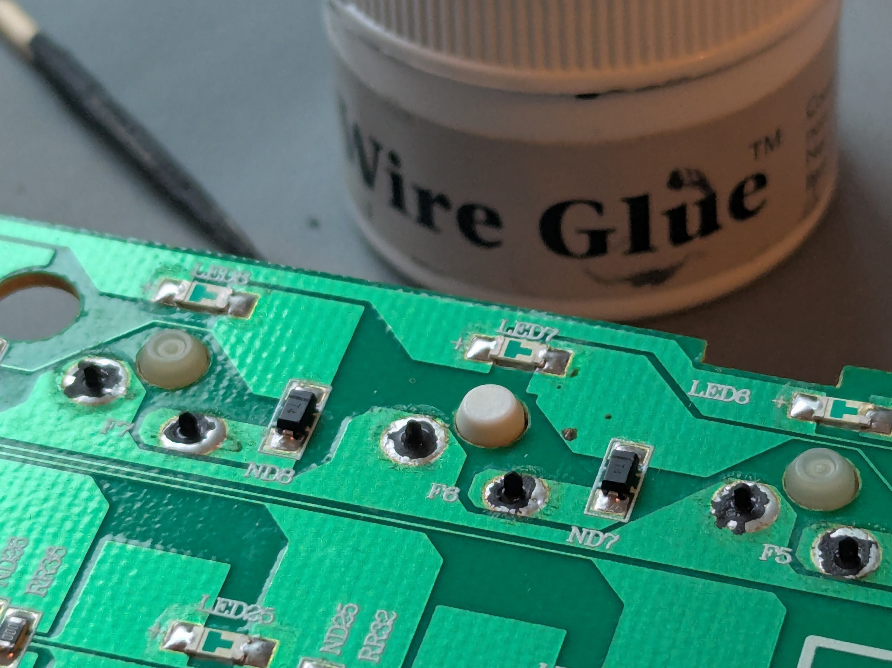

# Wire Glue™ for Keyboard Stuff
> Does this stuff work for keyboarding?
>
> 

## 1. LED board: Inconclusive
I wired up an RGB LED to a button cell battery and three switches so my daughter could control its color. I messed up the wiring and moved on, but where I didn't
- the wire glue worked as conductive, but
- there was clear resistance in the connection (maybe the glue), making the LED quite dim compared to when hooked up to the battery directly.

It was my first attempt with wire glue. Three notes:
- I spilled some when I opened the jar: the glue separates and gets a very watery top.
- It requires quite some stirring before first use, and later.
- It applies like... egg yolk? Maybe a bit thinner.

> Brand new:
>
> 

> I applied it with a toothpick:
>
> 

## 2. Adhering Switches: Success
To test whether the wire glue is conductive enough for a keyboard matrix, I glued three switches to an old, desoldered Havit KB435L PCB I had lying around. I let it cure over night.

Three observations:
- The wire glue works for establishing connection between switches and PCB. At least the maybe 200 keypresses I tried all registered without issue.
- It's not a strong adhesive: a switch came off the second time I pulled a keycap off it, holding in the PCB and keycap (no plate).The glue explicitly states that one should use e.g. super glue to strengten bonds.
- I reapplied. I should perhaps have applied less.

I wonder:
- How difficult will it be to clean this stuff off if one wants to solder instead?
- Will super-gluing hotswap socket to a PCB with wire glue on the pads work?

> PCB before gluing:
>
> 

> Glue applied:
>
> 

> Glue cured:
>
> 

> Yay, they work!
>
> 

> Torn off switch. Seems I added superflous glue.
>
> 
