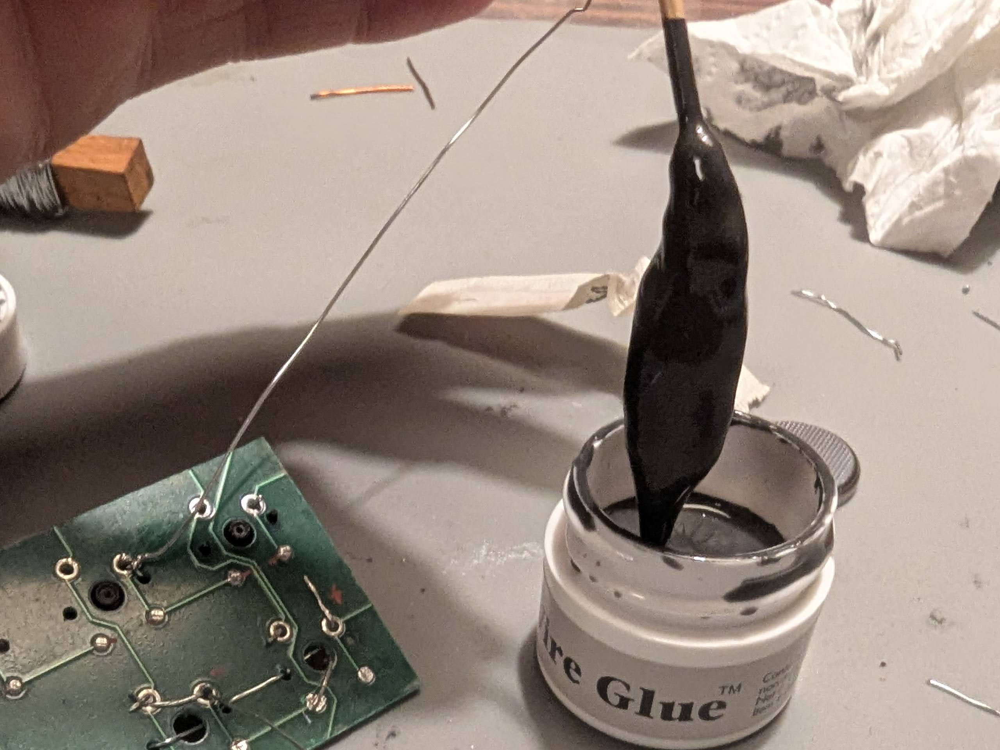

# Wire Glue™: Will it Keyboard?
Wire Glue™ promises to electrically conductively bond low voltage electrical connection. If wants to avoid soldering (for whateever reasons), does wire glue offer some kind of alternative?

> <table cellpadding="0" cellspacing="0">
>   <tr>
>     <td>Does this stuff work for keyboard stuff?  Yes, for some things. 
>   </tr>
> </table>

## Test 1. LED board
In my first attempt with the wire glue, I wired up an RGB LED to a button cell battery and three switches so my daughter could control the LED color. I messed up the wiring and moved on.

Where the wiring was in order, I saw that:
- The wire glue conducted.
- There was resistance in the connection (maybe the glue): the LED was notably dimmer compared to directly touching it's legs to the battery.

 Three notes on use:
- I spilled some when I opened the jar: the glue separates and gets a very watery top.
- It requires quite some stirring before first use, and later.
- It applies like... egg yolk? Maybe a bit thinner.

> <table cellpadding="0" cellspacing="0">
>   <tr>
>     <td>Brand new:  
>     <td>I applied it with a toothpick:  
>   </tr>
> </table>

## Test 2. Connecting Switches
To test whether the wire glue is conductive enough for a keyboard matrix, I glued three switches to an old, desoldered Havit KB435L PCB I had lying around. I let it cure over night.

Observations:
- The wire glue works for establishing connection between switches and PCB. At least the maybe 200 keypresses I tried all registered without issue.
- It's not a strong adhesive: a switch came off the second time I pulled the keycap off it, me grabbing the PCB and keycap (no plate).The glue explicitly states that one should use e.g. super glue to strengten bonds, so I don't hold it against it.
- I applied glue twice to every join. I should perhaps have applied less.
- It seems to have come off the off'ed switch and PCB easily (cotton swap + isopropyl alcohol). I didn't try soldering after, but the surfaces look clean enough.

> <table cellpadding="0" cellspacing="0">
>   <tr>
>     <td>PCB before gluing:  
>     <td>Glue applied:  
>     <td>Glue cured:  
>   </tr>
>   <tr>
>     <td>Yay, they work!  -</td>
>     <td>Torn off switch.  Seems I added superflous glue.</td>
>   </tr>
> </table>

## 3. Open Questions:
- Will super-gluing hotswap socket to a PCB with wire glue on the pads be strong enough?