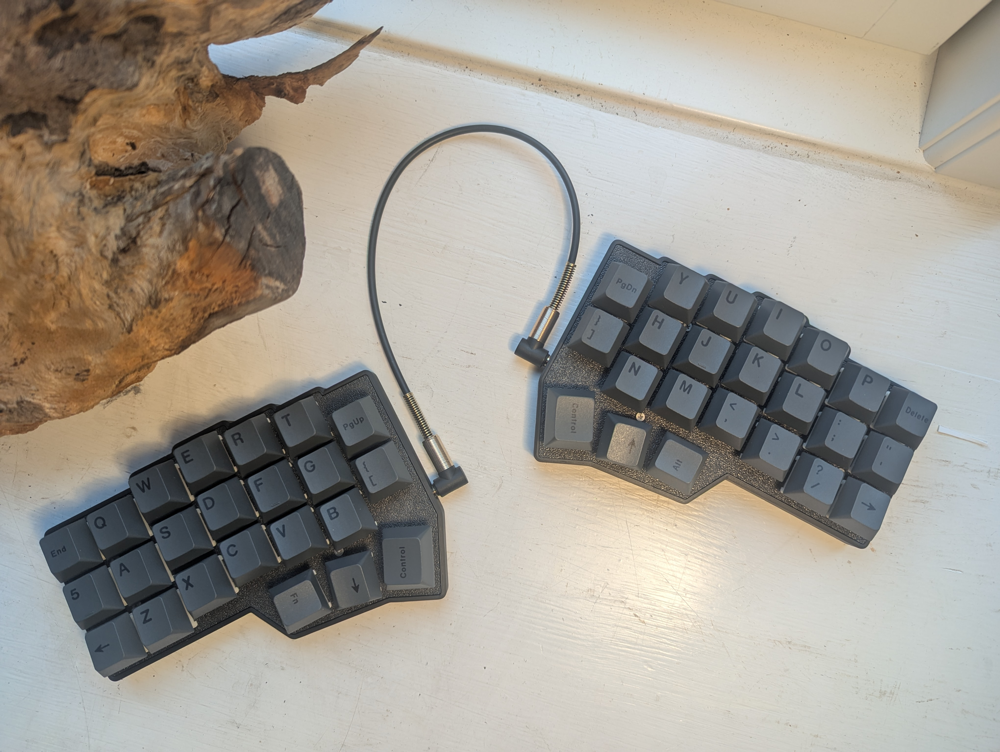
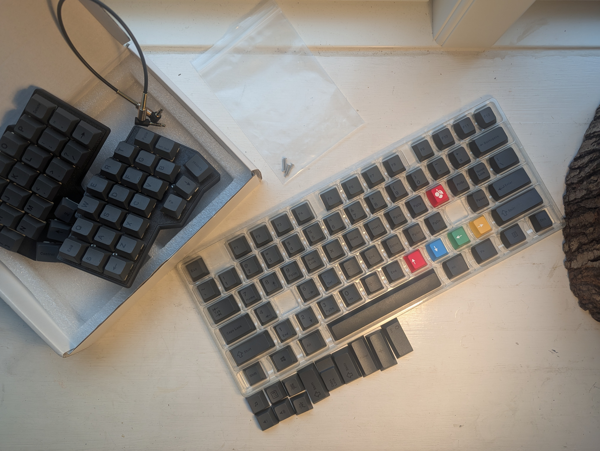
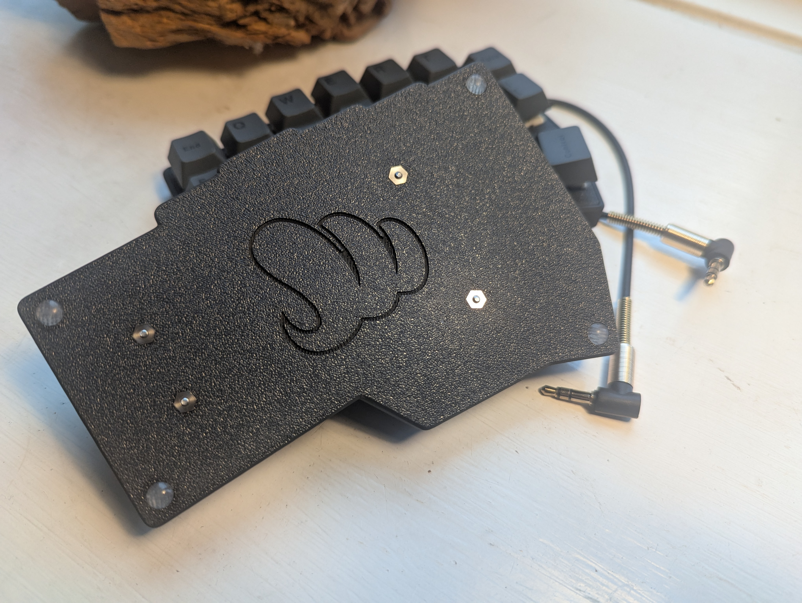

An AliExpress Corne 4.1 build with minimal black keycaps. I used linear MMD Ice Cream v4 switches.

I tried tactile AKKO Cream Purple Pros in it, but felt that it became quite noisy with those. Same with the also tactile MMD HTs. The bit of foam that the case admitted didn't help enough. Maybe I should try filling it with adhesive putty next time.

I think the keycaps suit the case.

Board and the remaining keycaps. I'd perhaps use Tab and /| for the two big thumb keys, as they fit in size, and have less aggressive slanting than the mods.

I'd prefer a case that hides the switches. But the case is else very nice. I don't know anything about 3D printing though.

I really like the i sets for the screws in the case, so there's no feat of damaging a plastic case when accessing the PCB.

No boot or reset buttons. It was straightforward to re-flash the Vial firmware from foostan's repo anyway, but I'd have preferred buttons.
