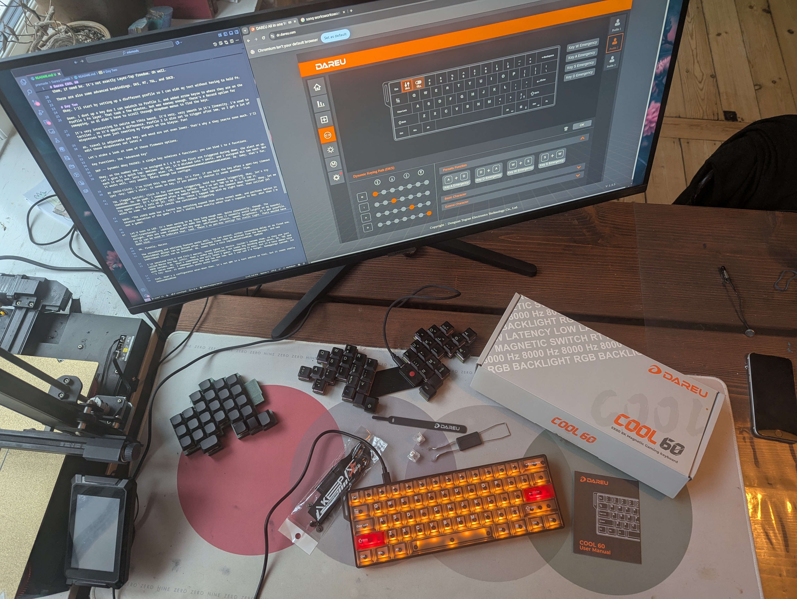
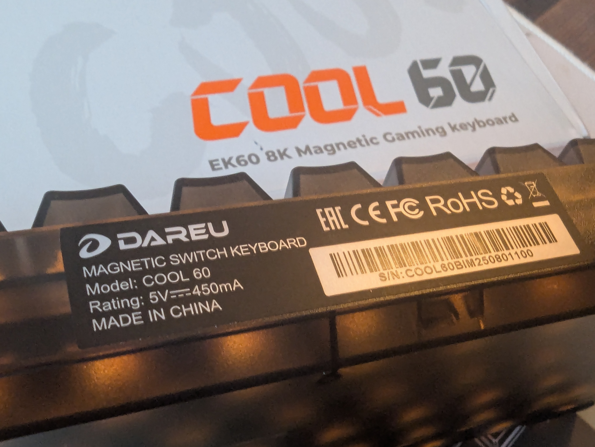
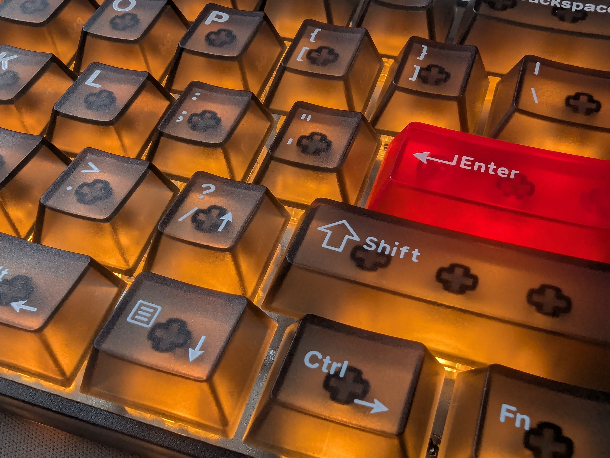
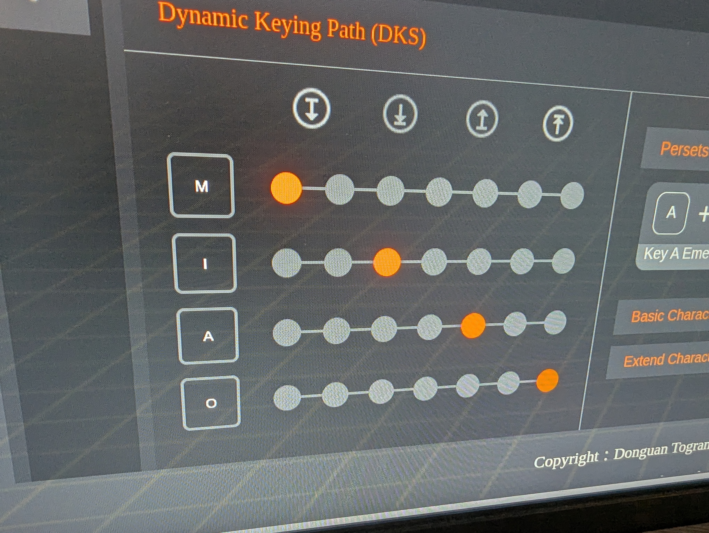

# DAREU COOL 60

## Preamble
I mainly use a keyboard for programming, text typing and editing, and OS operations. I normally use ergonomic keyboards and am pretty deep into remapping. When I game I almost exclusivly do so wiuth a controller. But when Dareu asked me if I wantred to revfiew this new boawrd of theirs, I clearly said sdyes, as I'm keyboard curious and don't know anything about HE boards. They asked me to mention taht it's on sale from Nov mioa on their Amazon shop DAREU GAMING. So now you know :)

   

## First Thoughts
Alright, it sounds surprisingly well out of the box! Zero stabilizer rattle. Okay! No mods that *needs* doing -- nice!

Nice that they've placed arrow keys on the right-hand `?-Alt-Menu-Ctrl` keys. The manual doesn't mention Fn-lock, but I'd like to lock Fn so I always have arrow keys. Hm, it doesn't mention where to find a configurator either.

The product website didn't mention a configurator either, but Google led me to [Dareu's driver page](https://dareu.com/en-eu/pages/driver), where I see the Cool60 is supported by the [ALL in one WEB configurator](https://dr.dareu.com/). Nice, it works in Chromium on Linux. No reason to bust out my emergency Windows 12.5" ThinkPad X250.

All, right, checking out the web configurator. Seems like there are two layers available, Standard and Fn Mode. In Fn mode, some keys are locked -- cannot be remapped: `Tab`, `W`, `}`, `Win`, `Space` and `Fn` itself. Hm, okay. So I cannot implement my default SpaceFn, as that would have me remap `W` to Workspace Up.

Well, I can remap `.` to `Backspace` on the Fn layer, that should make editing easier, though I still have to hold down `Fn` with my pinky. Done.

Clicking around, I see it also has it also has three profiles available. And I can remap a key to switch betweeen them. So I can set up a profile with arrow keys on the Standard layer. Then toggle between profiles, if need be. It's not exactly QMK Layer-Tap freedom. Oh well.

There are also some advanced keybindings options: DKS, MT, TGL, and SOCD. MT gives a pretty basic tap-hold option. Remapping `CapsLock` to `Control` on hold, `Escape` on tap was easy enough. Whether the key is held or not seems to be given just by the time-out. At least pressing another key before the time-out doesn't trigger the hold-behavior. But the time-out is per-key, so one has some wiggleroom.

 

## Day Two
Okay, I'll start by setting up a different profile so I can edit my text without having to hold `Fn`. 

Done. I set up a key so I can switch to Profile 2, and added arrow key to where they are on the Profile 1 Fn layer. That took a few minutes, but was easyy enough. There's a Record option for remapping, so I didn't have to scroll through dropdown menus to find the keys.

*Left unedited for illustrative purposes:*
It's very interesting to rwirte on tthis baord. It'd very, very smooth in it's linearity. I'm used to tactiles, so it'd qquite a difference. Profile 2 is also set to trigger after 1mm, so I get a lot of mispresses by even just rewsting my fingers on the kieysw. Fun!

Ah, travel is adjustable per key, and WASD are set even lower. That's why a they react sooo much. I'll have to edit some of these mispresses out later :D

### Configurator
Let me take a look at some of those firmware options.

*Key Functions, the "Advanced Key".*

 

- `DKP -- Dynamic Key Paths: A single key acheives 4 functions: you can bind 1 to 4 fucntions.`

Okay, on the number one key, I've assigned M I A O so the first are triggered during down, the alast on up. Let's give it a quick tap: mmiiaao. Ah yes, it'd divided into 7 parts, and I assigned MIA two each. Not each is only one, lets try again: miao. LOL. momomomomomiaomomiaomomiaomiaomiao. Ha. Oaky, that's fun. It works well, very smooth. EEasy enough tod configre.

- `MT -- Hold/Click.` I tried this the other day. It's fine. If you hold the key longer that per-key timeout (per-key: that's nice), it sends one key, if you press it shorter it sends another. Fine.

- `TGL (Toggle Switch): Click it for continuous triggering, hold for normal triggering.`

Okay, let's try thatMIAO. Ha. Oh yeah, I remapped the one key before, so exclamation marks are hard :D Now I've set two (2) to be a TGL-key for o. I'll tap it. ooooooooooooooo. DI't trigfgered after a swmall delay. Can't turn the timeout down furhter. Okay, let me try again, while I roll on jkl. ojkl. Okay, tehre I tapped TWO with my right hand, then roilled jkl witht he same. So other keys cancel the continious triggering.

- `SOCD: The SOCD mode has a faster key switching aspeed than dtthe normal mode, and performs better in reverse operation of the game.`

I don't really know exactly wehat that's suppose to doa, about then I'm not a gamer.

*Lighting.*
Let'd turn to LED. It's been "waving" in my face long enough now. Quite pleasantly, though. The half-translucent, smokey keycaps make the RGB quite fun (I normally avoid lights on my boards). Alright, there are some standard settings, different effects, speed, brightness. It's per-profile, so it can be used to indicate profiles. Cool. There's no per-key settings for static light. That would have been nice. To make WASD light up in red, surrounding keys in yellow or whatever.

*Macros.*
Ok, finally, macros. 

The recording and editing feature works well. You can record, using either recorded delay or a fixed one. Individual delays can be edited after. Recorded items can be deleted from the macro, and new individual clicks can be inserted. Ok, seems like a nice implementationMIAO HaMIAO

To test, I've now recored Ctrl-C and Ctrl-V macros, saved them to device. Couldn't rename them, so they are just called Macro 1 and Macro 2. Remapping keys to macros is under Key Function, not under Key Binding where DKP, MT, TGL and SOCD resides. Ok, that's something one will learn I guess. Remapping is easy, but it'd have been nice with macro names. I remember what 1 and 2 are now, but I think I'll soon forget. Remappings saved, let's try: Nice, it works works works works works.

Cool, that's a configurator rundown then. It's not QMK or Vial, but it seems really reasonableMIAO The HE switch features seem easy to play around with, and I suppose that's the main thing.

I'll commit this now, then edit it to remove the mispresses I've managed to make on these super sensitive switches with my used-to-tactiles-and-columnstagger fingers :D

momomomomomiaomiaomiaomiaomiaomomiaomomomiaomiaomiaomiaomiaomiaomi