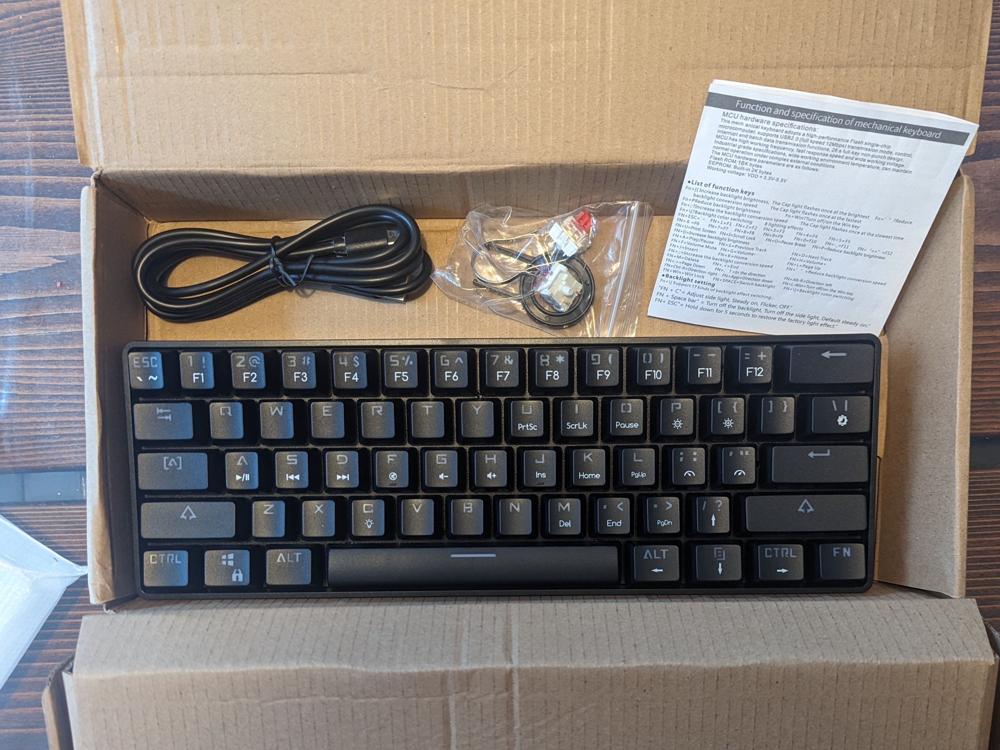
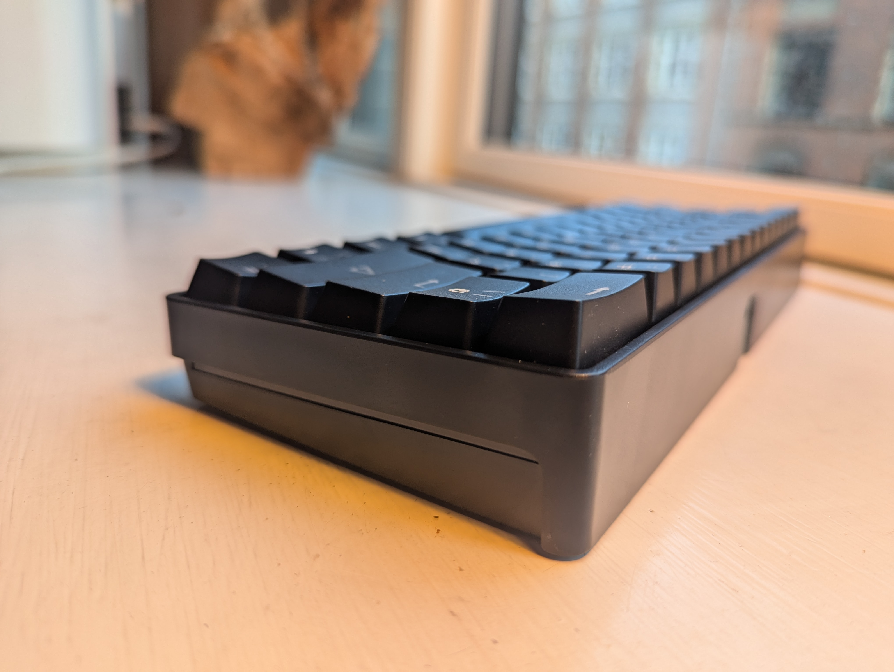
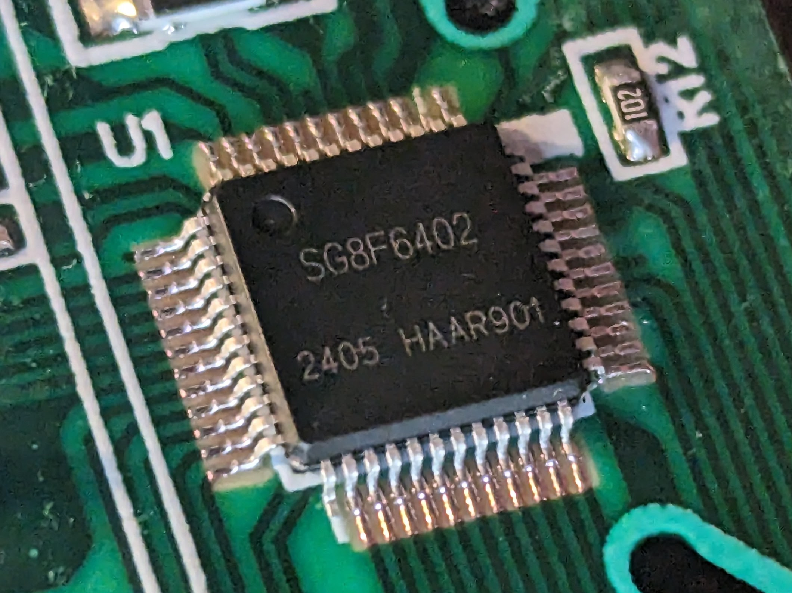
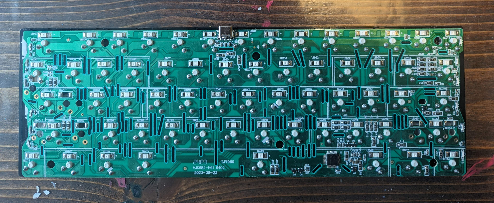
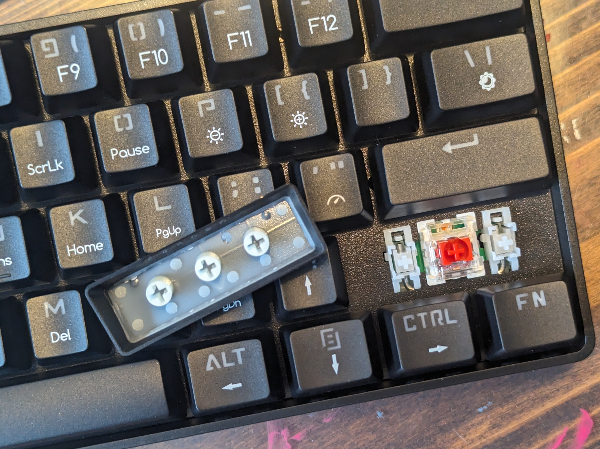
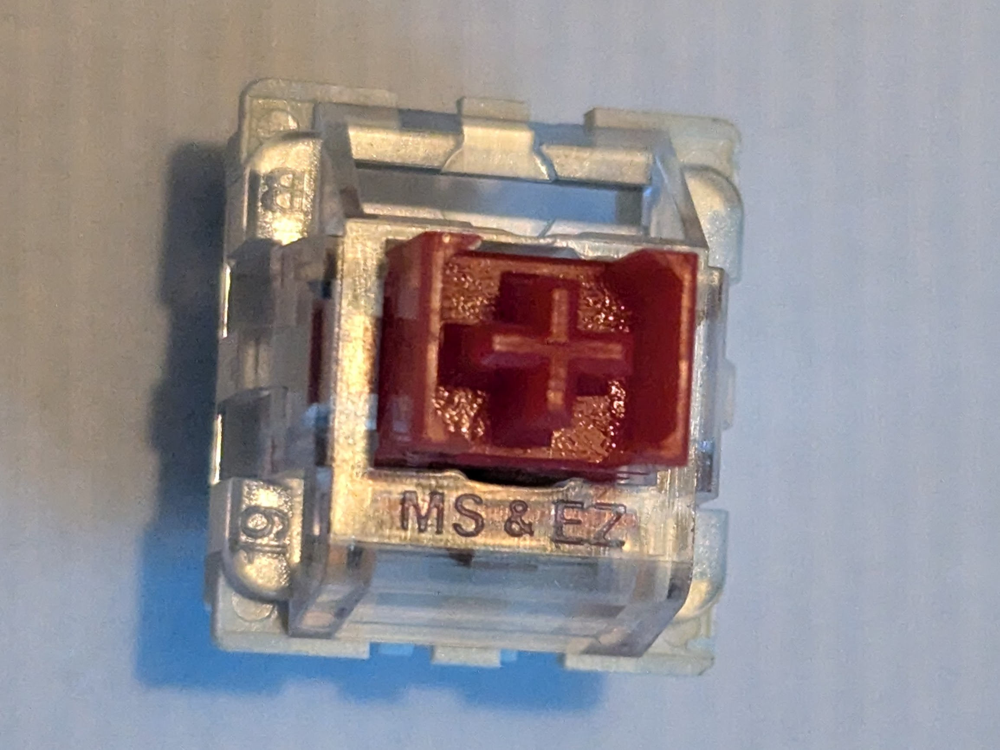
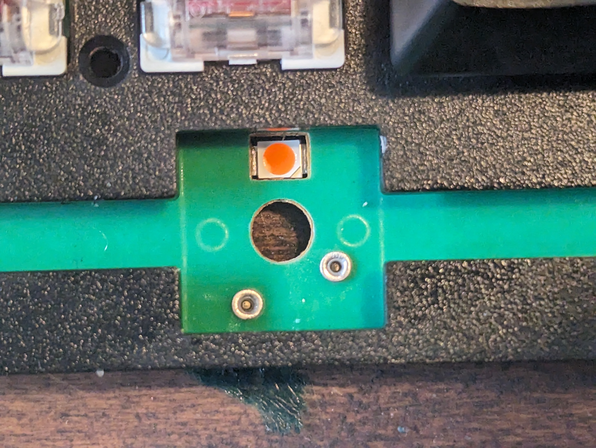

# MUCAI MK61-HEI 60%

**AliExpress, US $13.99, free shipping.**

## TL;DR
- Double-shot keycaps, hotswappable switches.
- The build-quality is as low as the price.
- The MCU is does not seem directly compatible with QMK/SonixQMK.

## Observations

### Build
Both case and 1.5mm plate are plastic, and the whole construction is quite flexible. The full board weighs in at 387g. It rattles when picked up. Open by 6 screws under keycaps. There are lots of plastic wall raisers in the bottom of the case making adding foam difficult.

### MCU and PCB
I bought it in the hopes that the MCU might be compatible with QMK/SonixQMK. The MCU is SG8F6402, the PCB is HJK682-K61. Neither gave me any results that I know how to utilize.

The mounting holes of the PCB are located in the "standard" Poker-case 60% placement---see the photo above, where the screws are located between the removed keycaps.

### Keycaps
The keycaps are in fact double-shot. OEM profile. The inner layer only extends a few millimeters down the sides, so the main walls are only 0.9mm thick.

### Switches
Linear switches labelled 'MS & EZ'. Not scratchy, but the leafs make a slight sound even when the stems is moved up and down carefully. There is an incredible spring ping. They make the case sing -- and again, every part of this is plastic, plate included! I'm almost impressed.

### Stabilizers
The stabilizers are plate mounted, do not require clipping, and come totally unlubed. The rattle is a symphony.

### Hotswap sockets
The hotswap sockets are simple rivet-style "sockets". They don't seem to have a MillMax-like construction, but seem to be just tight rivets. The switches stick in them. I haven't tried other than the default switches.

## Thoughts
My best friend's 12 year old games on some beaten, cheap full-size mechanical he's inherited from a friend. It's short of a few keycaps. I can't bring myself to gift him this MUCAI board as a replacement.

It's so unpleasant from the outset that I kinda want to mod it just to see if I can make it reasonable. But only almost. If the MCU supported QMK/SonixQMK, I would.

