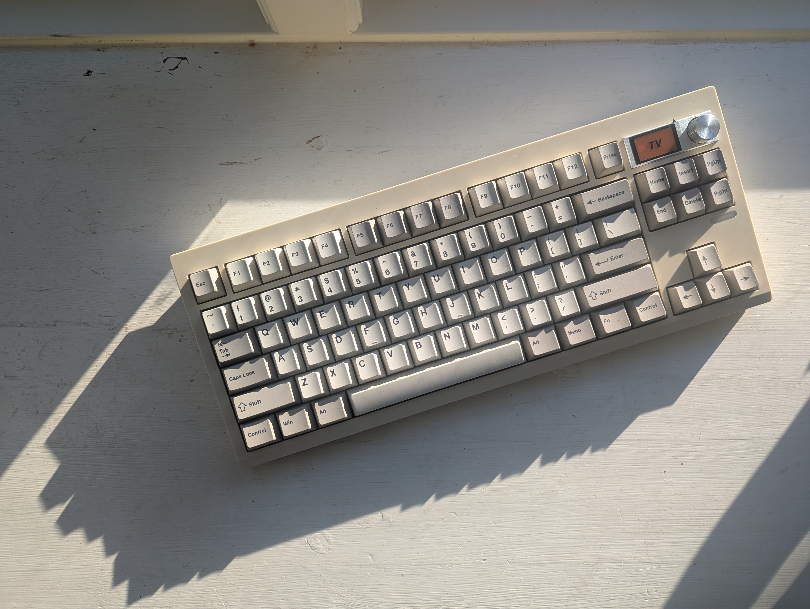
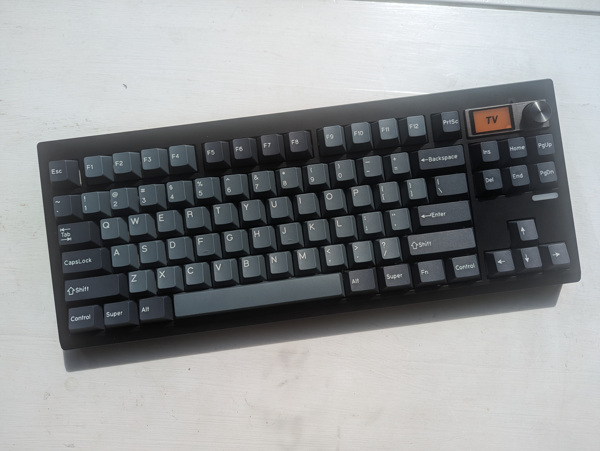
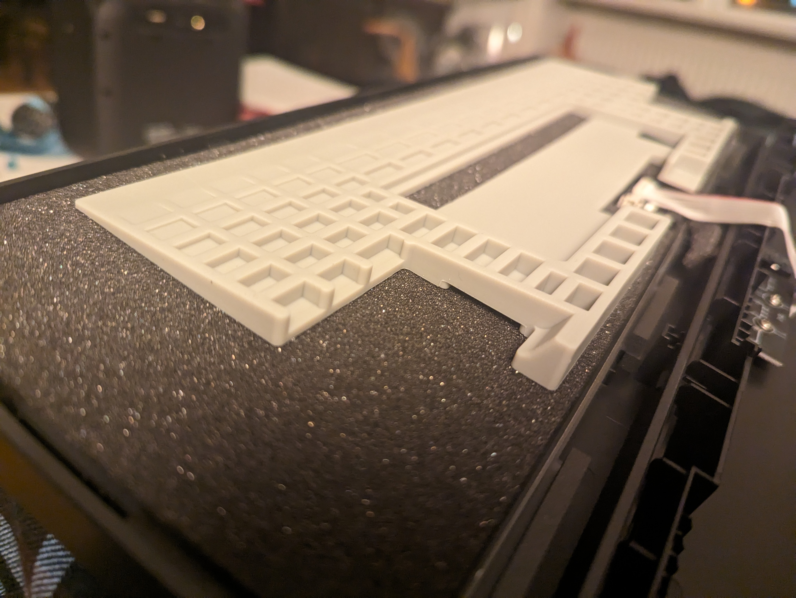

# Zuoya GMK87

- They are easy to make sound good.
- I wish I didn't dislike and somewhat distrust Zuoya.
- I dislike Zuoya because they do not open-source their firmware, despite relying on QMK, thus violating license.
- I wish the boards proper QMK, wired only, no screen and available in ISO.

*Camel with retro keycaps* | *Black with Apollo clones*
--------- | ---------
 | 

## Firmware
Firmware updater, VIA json, and GIF tool (also used to set the time) can be downloaded from [zuoya.top](zuoya.top). I use the Firefox-offered translation to navigate. It's then under `Driver and Firmware`, all in one file named `ZUOYA-GMK87-json文件.rar`

I've added the two json files to this directory. I've only used the wired one.

The GIF upload tool also sets the time. It can take quite a while for a GIF to be loaded to the board. It also messed up for me, but overriding the borked GIF worked.

## VIA
To use VIA, I've had to first do the firmware update.

Then visit [usevia.app](usevia.app) in a Chrome-based browser. Do:
- in `Settings`, check `Show Design Tab` and `Use V2 Definitions`,
- in `Design Tab`, load JSON.
- remap

## Issues
- Function keys F1--F12 sends weird commands: 
**Solution:** While wired, switch from Win to Mac mode and back.
- VIA on Linux gives error _Received invalid protocol version from device_. 
 **Solution:** [Per this comment](https://github.com/the-via/releases/issues/257), I accessed `chrome://device-log/` and saw `Failed to open '/dev/hidraw1': FILE_ERROR_ACCESS_DENIED`. Running `sudo chown $USER:$USER /dev/hidraw1` solved problem.

## Insides

 

