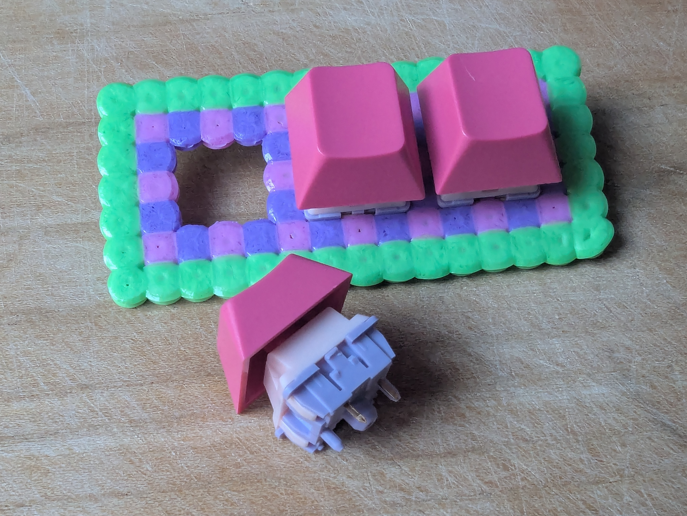
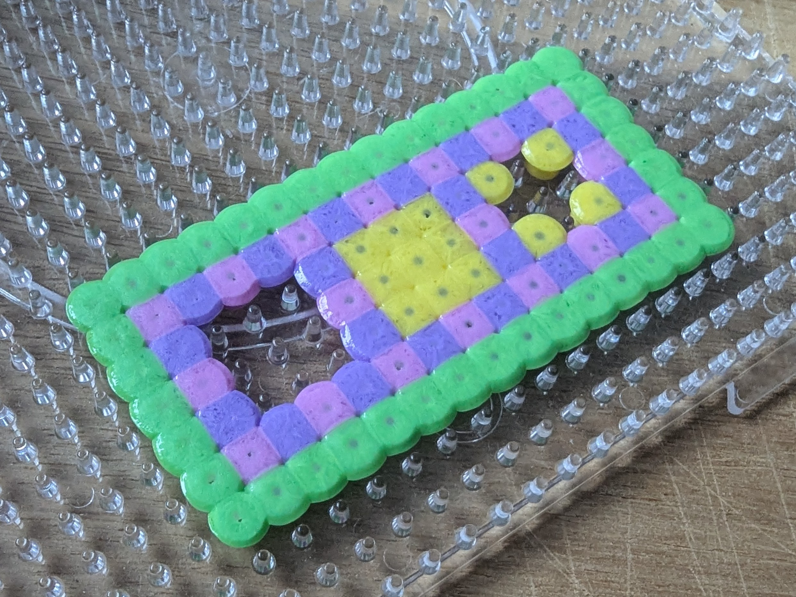
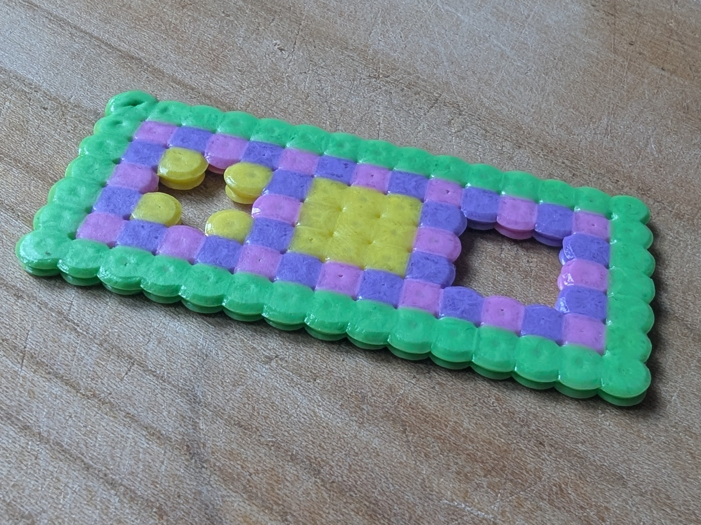
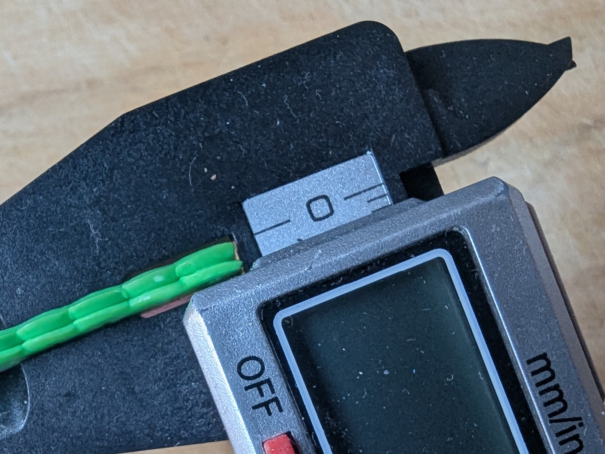
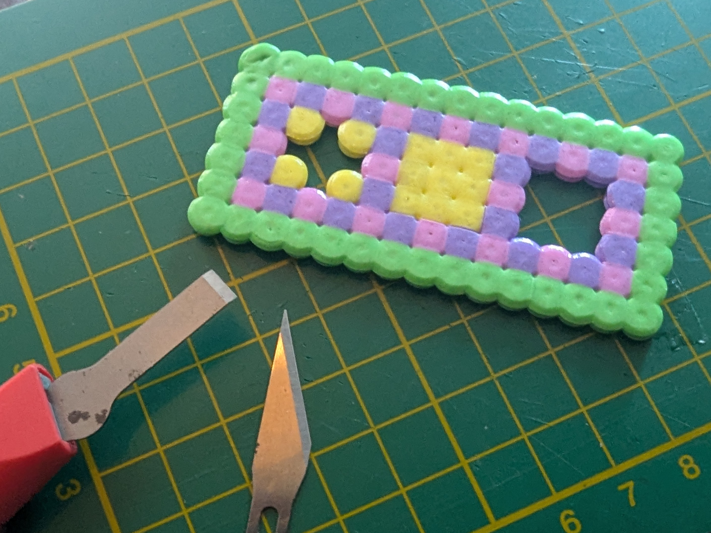
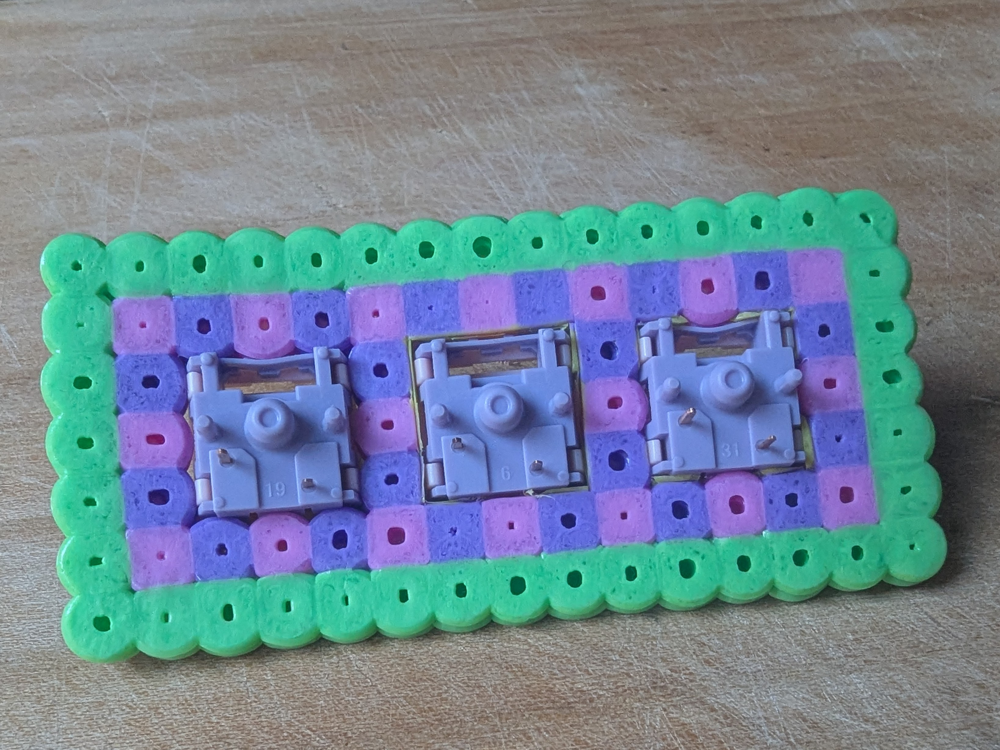
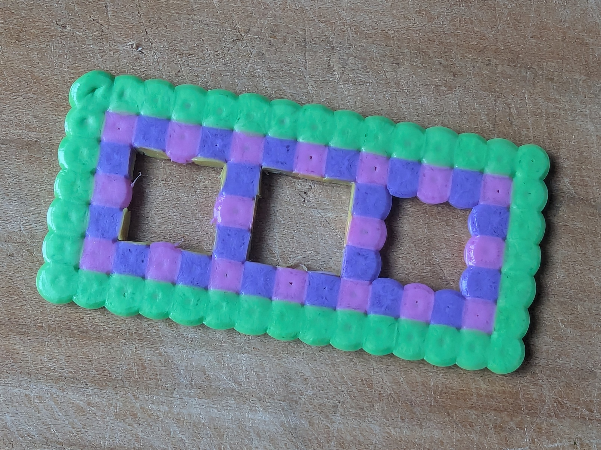
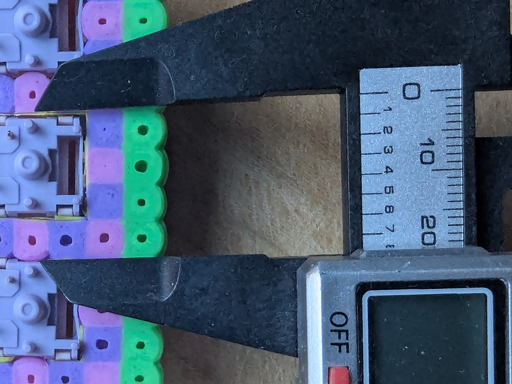

A Saturday morning experiment while my daughter was doing a Hama bead pot holder. Maybe it'll be a viable plate option for a revision of her [Hama bead hitbox](homemade/frejas/README.md)

I experimented with whether the switch holes would for better if they were empty, had cut-away inner corners or cut-away full interior. Gladly, I found that the empty switch holes held the best, then cut-away cornes, then full. I wish I'd thought of trying cut-away mids, too.

I ironed it quite hot.

## Process

